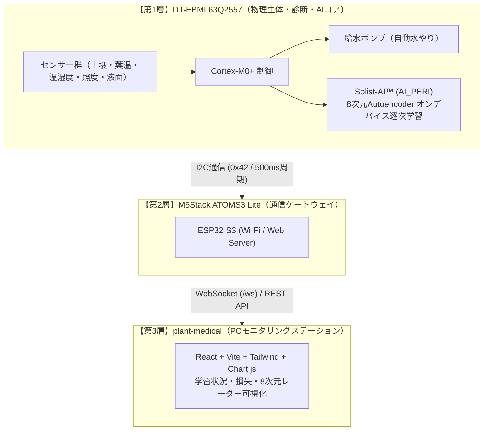

# 第1章 エッジAIと植物生体センシング入門

## 1.1 植物の「声なき声」をどうやって聴くか？

動物や人間は、喉が渇けば水を求め、体調が悪ければ声を上げます。しかし、植物は動くことも声を出すこともできません。
人間が植物の異変（水不足や病気）に気づくのは、多くの場合「葉が黄色く変色した」「茎がしおれて垂れ下がった」という**目に見える手遅れに近い段階**です。

では、植物が苦しんでいるサインを、目に見える前（潜伏期）に察知するにはどうすればよいでしょうか？
その鍵となるのが、植物の生体活動である**「蒸散（Transpiration）」**と**「葉面温度（Leaf Temperature）」**です。

---

### ① 気孔（Stomata）と蒸散のメカニズム
植物の葉の裏側には、無数の「気孔」と呼ばれる微細な穴が存在します。植物は気孔を開いて二酸化炭素（$\text{CO}_2$）を取り込み、光合成を行いますが、同時に葉の中の水分が水蒸気となって大気中へ逃げていきます。これが**蒸散**です。

水分が蒸発する際、周囲から**気化熱（潜熱）**を奪います。打ち水をすると涼しくなるのと同じ原理です。
そのため、**健康で十分に水を吸い上げている植物の葉面温度は、周囲の気温よりも $0.5 \sim 2.0^\circ\text{C}$ ほど低く保たれます**。

```
【健全な植物（水分十分・気孔が開いている）】
  根から吸水 ──> 葉から活発に蒸散 ──> 気化熱が奪われる ──> 葉温 ＜ 気温（葉がひんやり冷たい）

【水ストレス・病気の植物（水分不足・気孔を閉じる）】
  吸水不能 ──> 葉の脱水を防ぐため気孔を閉鎖 ──> 蒸散ストップ ──> 気化熱冷却が停止 ──> 葉温 ≧ 気温（葉が熱を持つ）
```

### ② なぜ「葉温」と「気温」の差分（$\Delta T$）が重要なのか？
単に「葉の温度が $28^\circ\text{C}$」と測っても、それが猛暑の日の正常な値なのか、部屋が涼しいのに植物が干からびて発熱しているのかは判断できません。

そのため、Plant Doctor では非接触赤外線温度センサーで測った**葉面温度（$T_{\text{leaf}}$）**と、温湿度センサーで測った**環境気温（$T_{\text{air}}$）**の引き算：

$$\Delta T = T_{\text{leaf}} - T_{\text{air}}$$

を最も重要な生体特徴量としてリアルタイム追跡しています。
- **$\Delta T < 0$（例: $-1.5^\circ\text{C}$）**: 気孔が開き、活発に蒸散冷却が行われている（健全）。
- **$\Delta T \approx 0$ または $\Delta T > 0$（例: $+1.0^\circ\text{C}$）**: 蒸散が止まり、葉が周囲の気温以上に過熱している（深刻な水ストレスまたは根腐れ等の生体異常）。

---

## 1.2 なぜクラウドではなく「エッジ（超低消費電力マイコン）」でAIを動かすのか？

AI（人工知能）と聞くと、多くの人は巨大なデータセンターやクラウド（GPUサーバー）で動くChatGPTや画像認識モデルを思い浮かべます。
しかし、植物や農業の現場を想像してみてください。

- 畑やビニールハウス、山林、あるいはオフィスの観葉植物の鉢植えには、**常に安定したWi-Fiや電源コンセントがあるとは限りません**。
- 乾電池やコイン電池、あるいは小さなソーラーパネルだけで、**数ヶ月〜数年間にわたって無停止で動き続ける**必要があります。
- 水やりポンプの制御は、通信が途切れたクラウドの応答を待つのではなく、**現場のマイコンがミリ秒単位でリアルタイムに判断**しなければなりません。

| 比較項目 | クラウドAI (Cloud AI) | エッジAI (TinyML / On-Device AI) |
|---|---|---|
| **処理場所** | 遠隔地のデータセンター (GPUサーバー) | 植物の鉢に挿したマイコンチップ内部 |
| **消費電力** | 数十W 〜 数百W（常時AC電源） | **数mW 〜 数十mW（乾電池で年単位駆動可能）** |
| **通信依存** | インターネット常時接続が必須 | **完全オフラインでも推論・学習・ポンプ制御が可能** |
| **遅延 (Latency)** | 数百ms 〜 数秒（ネットワーク通信遅延） | **数ms（超低遅延・リアルタイム応答）** |
| **プライバシー** | データを外部サーバーへ送信 | 内部で処理し、外部へ漏洩しない |
| **データ通信コスト**| センサー生データを常時アップロード | 異常検知時や集計値のみの軽量通信で済む |

Plant Doctor では、まさにこの「現場で完結する自律性」を実現するために、超低消費電力マイコン上で直接AIモデルを動かす **TinyML（Tiny Machine Learning）** アプローチを採用しています。

---

## 1.3 ROHM ML63Q2557 と Solist-AI™ の位置づけ

Plant Doctor のメインブレインには、ローム（ROHM / ラピスセミコンダクタ）製の超低消費電力 32-bit マイコン **ML63Q2557** が使われています。

```
+─────────────────────────────────────────────────────────+
|               ROHM ML63Q2557 マイコン                    |
|                                                         |
|  +─────────────────────────+  +──────────────────────+  |
|  |    ARM Cortex-M0+ CPU   |  |   AI Accelerator     |  |
|  |     (最大 32MHz, 低電力)  |  |    「AI_PERI」       |  |
|  +─────────────────────────+  +──────────────────────+  |
|  | ROM: 256KB              |  | Solist-AI™ ライブラリ|  |
|  | RAM: 32KB               |  | - 3層Autoencoder     |  |
|  | FRAM / 低電力RTC        |  | - 逐次学習 (RLS)     |  |
|  +─────────────────────────+  +──────────────────────+  |
+─────────────────────────────────────────────────────────+
```

### 特長 ①：超小型・超低消費電力 ARM Cortex-M0+
一般的なパソコンが数GB、スマートフォンが数GBのメモリ（RAM）を持つのに対し、ML63Q2557 の RAM はわずか **32KB** です。この限られたリソースの中で、OS（Linux等）を載せずに、直接ハードウェアを制御する「ベアメタル C言語」でファームウェアが実装されています。

### 特長 ②：オンデバイス学習専用ハードウェア「AI_PERI」
通常、ニューラルネットワークの学習（バックプロパゲーションなど）には膨大な浮動小数点行列演算が必要であり、Cortex-M0+ のような軽量CPU単体で実行するとCPUが何秒も占有され、電池を激しく消耗します。
ML63Q2557 には、この学習・推論演算を高速かつ省電力で実行するための専用ハードウェア回路 **`AI_PERI`** が内蔵されています。
このアクセラレータと、ローム独自のオンデバイス学習技術 **Solist-AI™** が組み合わさることで、**「植物の健全状態を監視しながら、電池駆動マイコンがリアルタイムに自己学習し続ける」** という画期的な機能が実現されています。

---

## 1.4 システム全体の役割分担（3段ハイブリッド構造）

Plant Doctor は、役割の異なる3つのレイヤーが美しく協調して動作しています。



1. **第1層：ROHM DT-EBML63Q2557（生体診断・制御・AI推論/学習）**
   - 植物の鉢元に配置。10ms/100ms/1s の精密タイマでセンサーをサンプリング。
   - 独自のルールベース診断エンジンと、Solist-AI™ によるオンデバイス学習を並行実行。
   - 土壌乾燥時に自動給水ポンプを駆動。
   - 診断結果と学習状態を I2C スレーブ（アドレス `0x42`）へ 500ms 周期で出力。
2. **第2層：M5Stack ATOMS3 Lite（通信ゲートウェイ）**
   - DT-EBML から I2C 経由で受け取ったバイナリパケットを展開。
   - Wi-Fi ネットワークへ接続し、WebSocket サーバーおよび REST API サーバーとして動作。
   - PC やスマートフォンからの水やりコマンド・デモ切り替えコマンドを DT-EBML へ中継。
3. **第3層：plant-medical（PC Web ダッシュボード）**
   - ユーザーがブラウザで閲覧するリアルタイム生体ステーション。
   - ストレスバロメータ、病気予兆、給水履歴だけでなく、**Solist-AI™ の学習回数、再構成損失（MSE）、8次元特徴空間レーダー** を可視化。

---

## 1.5 まとめと第1章の確認クイズ

### 本章のキーポイント
1. 植物は水ストレスを感じると気孔を閉じるため、蒸散による冷却が止まり、**葉気温差 $\Delta T = T_{\text{leaf}} - T_{\text{air}}$ が上昇**する。
2. 現場で長期間・電池で植物を見守るためには、クラウドに頼らない**超低消費電力エッジAI（TinyML）**が不可欠である。
3. ROHM ML63Q2557 は、わずか 32KB の RAM でありながら、ハードウェアアクセラレータ **`AI_PERI`** によって **Solist-AI™ のオンデバイス学習** を可能にしている。

### 思考を深めるミニクイズ
* **Q1:** 夏場の晴れた昼間に、健康な植物の葉面温度を赤外線センサーで測ったところ、気温が $30^\circ\text{C}$ なのに対して葉温は $28.5^\circ\text{C}$ でした。これは正常でしょうか？
  * *(ヒント: 蒸散作用と気化熱を思い出してください)*
* **Q2:** なぜ Plant Doctor は、土壌水分センサーのデータだけでなく、葉面温度センサーも一緒に使っているのでしょうか？
  * *(ヒント: 土が湿っていても、根腐れや病気で水を吸えない植物はどうなるでしょうか？)*

---

次章 **[第2章 植物ストレス診断とバロメータ算出ロジック](02_plant_stress_scoring.md)** では、質問にもあった「なぜ平常時はストレス18なのか？」「なぜ葉温を急変させると100になり、数秒で戻るのか？」という診断アルゴリズムの内部設計を解き明かします！
