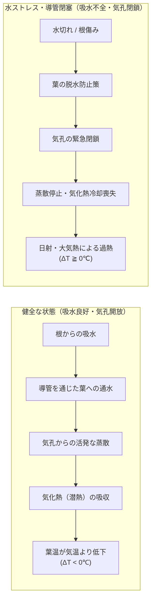
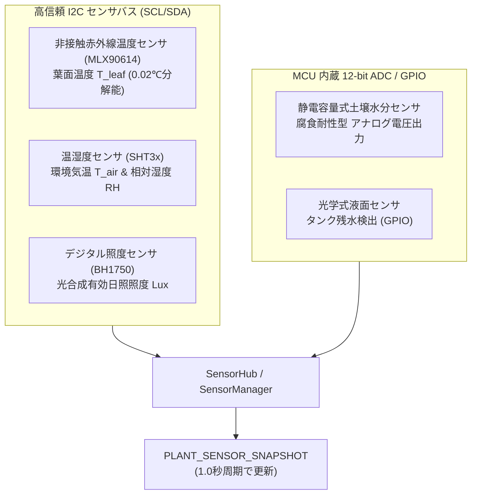
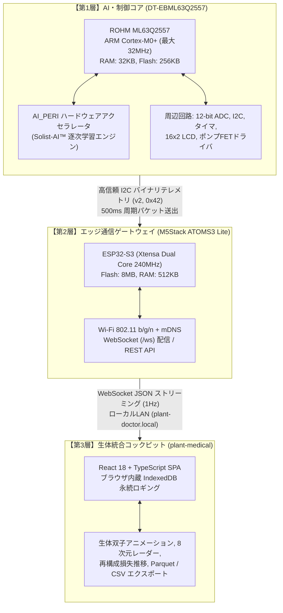

# 第1章 エッジAIと植物生体センシング技術

植物は自ら移動して水や光を得られず、言葉を発して異変を伝えることもできません。人間が葉の変色や茎の萎凋（いちょう）に気づく頃には、生体組織へのダメージが深刻化しているケースが大半です。

Plant Doctor は、植物が目に見える衰弱を示す前の「潜伏期」において、微細な生体信号の変化から体調不良を察知し、自律的に適切なケアを実行します。本章では、植物生理学に基づくセンシングの原理と、超低消費電力マイコンによるエッジ完結型AIの必然性について詳しく解説します。

---

## 1.1 植物生理学と生体情報センシングの原理

植物の生命維持活動の中核を成すのが、根から吸い上げた水分を大気中へ放出する**「蒸散（Transpiration）」**です。この蒸散作用に伴う物理現象を捉えることが、植物の健康状態を非破壊・リアルタイムに可視化する鍵となります。



### ① 気孔開閉と気化熱冷却（潜熱の収支）
植物の葉の表面や裏面には、「気孔（Stoma）」と呼ばれる無数の微小な開口部が存在します。気孔は一対の孔辺細胞（Guard Cells）の膨圧変化によって開閉します。
- **光合成と水分のトレードオフ**: 植物は気孔を開いて大気中から二酸化炭素（$\text{CO}_2$）を取り込みますが、同時に葉肉組織内部の水分が水蒸気として大気へと拡散します。
- **気化潜熱による冷却効果**: 水が液体から気体に相変化する際、周囲から約 $2.45 \times 10^6 \text{ J/kg}$（$20^\circ\text{C}$ 時）の気化熱を奪います。このため、正常に水を吸い上げて蒸散を維持している葉の表面温度は、周囲の環境気温よりも $0.5 \sim 2.0^\circ\text{C}$ ほど低く保たれます。

### ② 葉気温差（$\Delta T$）の物理的意義
単に「現在の葉面温度が $26^\circ\text{C}$ である」という絶対値を計測しても、それが冷房の効いた部屋での過熱状態なのか、猛暑の直射日光下で蒸散冷却が機能している健全な状態なのかは判断できません。

そこで本システムでは、非接触赤外線温度センサで計測した**葉面温度（$T_{\text{leaf}}$）**と、環境温湿度センサで計測した**周囲気温（$T_{\text{air}}$）**の差分：

$$\Delta T = T_{\text{leaf}} - T_{\text{air}}$$

を生体状態の最も直接的なバロメータとして定義しています。

- **$\Delta T < 0^\circ\text{C}$（例: $-1.5^\circ\text{C}$）**: 気孔が十分に開き、活発な蒸散による気化熱冷却が機能している（生体健全）。
- **$\Delta T \approx 0^\circ\text{C}$ または $\Delta T > 0^\circ\text{C}$（例: $+1.5^\circ\text{C}$）**: 土壌乾燥、根腐れ、導管閉塞などにより吸水が途絶え、脱水を防ぐために気孔を閉じた状態。蒸散冷却が止まり、葉が熱を蓄積している（水ストレス・生体異常の兆候）。

---

## 1.2 センサネットワークと物理計測インターフェース

Plant Doctor は、植物の生体情報および周辺環境を複合的に把握するため、以下の高精度センサ群を搭載しています。



### 1. 非接触赤外線温度センサ（MLX90614）
葉に直接触れることなく、物体が放射する黒体放射赤外線（シュテファン＝ボルツマンの法則に基づく赤外線エネルギー）を受光素子（サーモパイル）で検知し、デジタル値として取得します。
- 測定分解能: $0.02^\circ\text{C}$
- 計測範囲: $-70.0^\circ\text{C} \sim +380.0^\circ\text{C}$（ファームウェア内では $1/100^\circ\text{C}$ 単位の整数として処理）
- 接触による植物組織へのストレスや傷を一切与えずに、葉面局所の温度を高速に測定します。

### 2. 環境温湿度センサ（SHT3x）
植物が置かれた大気環境の乾湿状態と気温を高精度に計測します。
- 気温精度: $\pm 0.2^\circ\text{C}$
- 湿度精度: $\pm 2.0\% \text{RH}$
- 大気湿度は気孔の蒸散駆動圧（大気飽差 / Vapor Pressure Deficit: VPD）を決定づける重要因子です。大気が極度に乾燥していると、土壌に水があっても蒸散速度が吸水速度を上回る急性水ストレスが発生します。

### 3. デジタル照度センサ（BH1750）
植物の光合成活性を規定する光環境（可視光照度）を測定します。
- 計測範囲: $1 \sim 65,535\text{ Lux}$
- 光合成は光エネルギーをトリガーとして気孔を開かせるため、照度と葉気温差 $\Delta T$ は強い相関関係（日照が増えると気孔が開き $\Delta T$ が下がる）を持ちます。ファームウェア内では 24時間の積算照度（$\text{Lux}\cdot\text{h}$）を算出し、日照不足（`LOW_LIGHT`）診断の基礎データとしています。

### 4. 静電容量式土壌水分センサ（ADC）
土壌の比誘電率の変化（水: $\approx 80$、空気: $\approx 1$、乾燥土壌: $3 \sim 5$）を発振周波数の変化として捉え、電圧として出力します。
- 金属電極が直接土壌に触れて電解腐食する抵抗式センサとは異なり、絶縁皮膜構造により長期の連続測定が可能です。
- ファームウェア側で乾燥点（`DRY`）と飽和点（`WET`）の2点校正を行い、パーミル（$\text{‰}$、$0 \sim 1000$、すなわち $0.0\% \sim 100.0\%$）へ線形正規化します。

```c
/* SoilCalibration.c: 土壌水分電圧から‰への変換 */
int16_t SoilCalibration_ToPermille(uint16_t rawAdc, uint16_t calDry, uint16_t calWet) {
    if (calWet <= calDry) return 0;
    if (rawAdc <= calDry) return 0;
    if (rawAdc >= calWet) return 1000;
    return (int16_t)(((int32_t)(rawAdc - calDry) * 1000L) / (int32_t)(calWet - calDry));
}
```

### 5. 光学式給水タンク液面センサ（GPIO）
赤外線LEDとフォトトランジスタを内蔵したプリズム構造を採用しています。水が存在するときは光が屈折して外部へ逃げ、水がないときは全反射して受光素子に戻る原理で、非接触かつ即座にタンクの空状態（`TANK EMPTY`）を検出します。これにより、給水ポンプの空運転による焼損や破損を完全に防ぎます。

---

## 1.3 クラウド集中型からエッジ完結型（TinyML）へのパラダイムシフト

従来のIoTシステムでは、「センサ端末はデータをクラウドへ送るだけで、解析・学習・制御命令はすべてクラウド上のGPUサーバーが行う」という集中型アーキテクチャが主流でした。しかし、植物の生命維持においては以下の重大な障壁が存在します。

| 評価軸 | クラウド集中型アーキテクチャ | エッジ完結型（TinyML / Plant Doctor） |
|---|---|---|
| **通信インフラ** | 常時Wi-Fi / LTE通信が必須。電波の届かない山林や温室の奥では稼働不可 | **完全オフラインで動作可能。通信切断時も自律判断を継続** |
| **消費電力** | 無線モジュールが頻繁に通信するため、数Wの電力消費（常時AC給電） | **マイコンの省電力スリープを活用し、数mW〜数十mWで駆動可能** |
| **応答遅延 (Latency)** | ネットワーク通信やサーバー負荷により数百ms〜数秒の遅延 | **10ms刻みのローカルループ内で即座に異常遮断・ポンプ制御** |
| **セキュリティ** | 生体データや環境映像の外部流出リスク、サーバー停止リスク | **データはマイコン内部で完結。外部流出や不正アクセスの危険なし** |
| **通信・維持コスト** | 毎月の通信回線費、クラウドアカウント課金が発生 | **導入後のランニングコストはゼロ** |

植物の渇きや熱ストレスは待ってくれません。万が一ネットワーク障害が発生しても、鉢植えの横にあるマイコン自身が自律的に状況を診断し、必要であれば水を供給して生命を救う——この「現場における絶対的自律性（Local Autonomy）」を担保するために、マイコン内部でAIを動かす **TinyML（Tiny Machine Learning）** アプローチを採用しています。

---

## 1.4 3層ハイブリッドハードウェア構成

Plant Doctor は、堅牢な物理制御と柔軟なネットワーク配信を両立するため、責務の異なる3つの階層が密接に連携する構成をとっています。



### 1. メインMCU：ROHM ML63Q2557（第1層）
システムの頭脳として、全センサのサンプリング、診断ロジック、ポンプ駆動、LCD表示、そしてニューラルネットワークの逐次学習を実行します。
- **アーキテクチャ**: ARM Cortex-M0+（省電力かつ決定論的なリアルタイム応答）。
- **メモリ**: Flash 256KB、RAM 32KB。RTOSを使わず、10ms周期のステートマシンによるベアメタル（裸のハードウェア）C言語で構築されています。
- **オンデバイス学習専用回路 `AI_PERI`**: ニューラルネットワークの推論および学習（RLS逆行列演算・重み更新）をハードウェアレベルで高速実行します。

### 2. ゲートウェイ：M5Stack ATOMS3 Lite（第2層）
超小型（24×24mm）の ESP32-S3 搭載モジュールです。
- ML63Q2557 の I2C スレーブポート（アドレス: `0x42`）と接続し、500ms周期でバイナリテレメトリパケットを受信します。
- 受信データを JSON 形式へ変換し、Wi-Fi 経由でブラウザへ WebSocket ストリーミングします。mDNS（`http://plant-doctor.local`）に対応しているため、IPアドレスの直接入力なしで接続可能です。

### 3. 生体コックピット：plant-medical（第3層）
ユーザーがPCやスマートフォンのブラウザからアクセスする Webフロントエンドです。
- 通信が途絶えても過去の履歴が失われないよう、ブラウザ内の IndexedDB に生体テレメトリを秒単位でローカル永続保存します。
- 8次元生体特徴量のレーダーチャート、Solist-AI™ の再構成損失カーブ、植物のリアルタイム健康アニメーションを描画し、直感的な健康診断環境を提供します。

---

## 📖 ナビゲーション

[目次 (README)](README.md) ｜ **[第2章 多変量植物ストレス評価と自律診断アルゴリズム →](02_plant_stress_scoring.md)**

