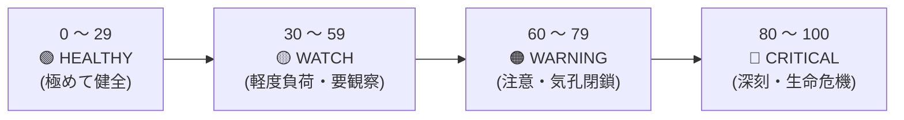
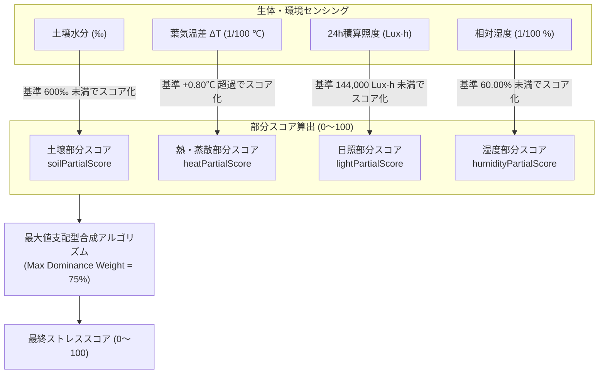
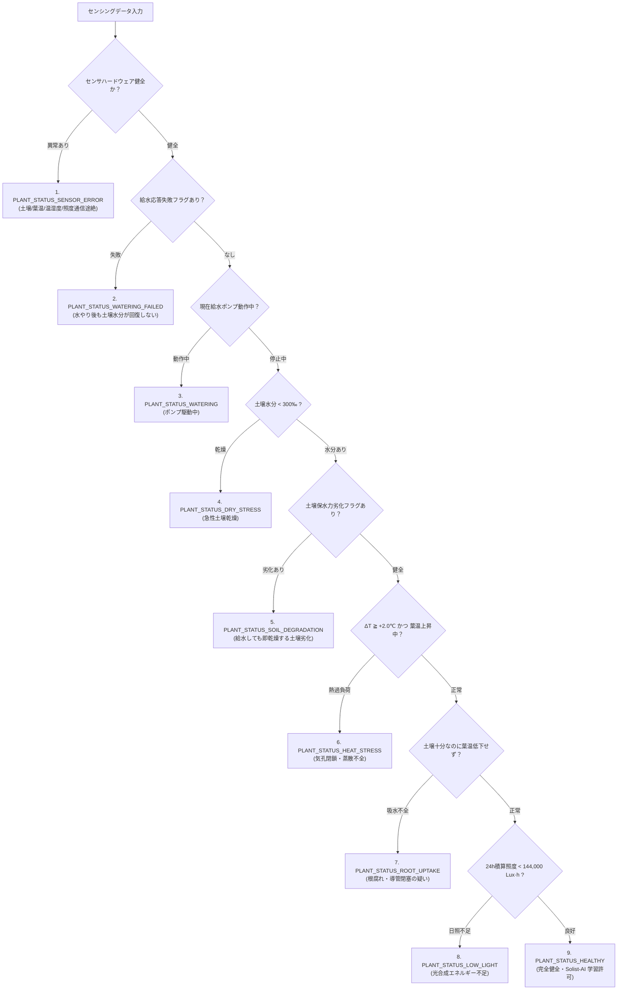
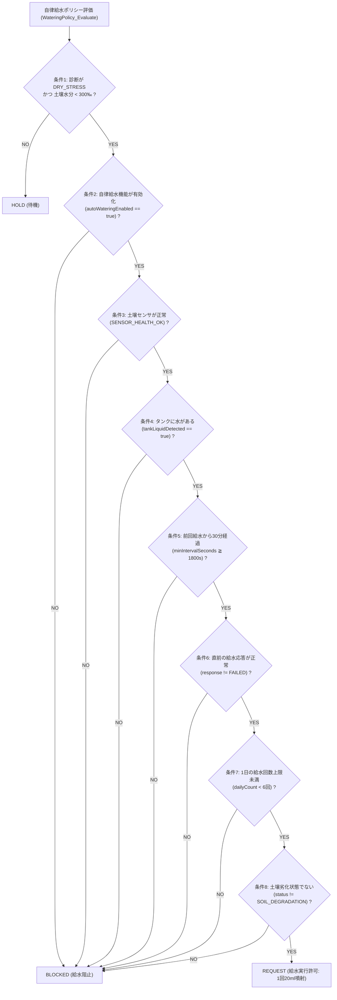

# 第2章 多変量植物ストレス評価と自律診断アルゴリズム

植物の健康状態を評価する際、単純な二値判定（「水が足りている / 足りていない」などのON/OFF判定）では、複合的な環境変化や初期の生体異変を見落とします。

Plant Doctor は、人間に対する総合健康診断のように、植物の生体負荷を **0〜100 の連続的なストレスバロメータ** として数値化し、同時に優先順位付きの**多段階状態診断（Status Diagnosis）**および**自律給水判断（7重インターロック）**をリアルタイムに実行します。本章では、その数学的アルゴリズムと内部実装を詳細に解説します。

---

## 2.1 ストレスバロメータの設計思想と 0〜100 フルレンジ評価

Plant Doctor のストレスバロメータは、植物が受けている生理的負荷の総量を直感的な 0〜100 のスコアとして出力します。



| スコア範囲 | 診断ステータス | 植物の生理状態 | システムの動作・制御 |
|---|---|---|---|
| **0 〜 29** | 🟢 **HEALTHY (健全)** | 気孔が開き、活発な蒸散と十分な土壌水分を維持 | **Solist-AI™ オンデバイス逐次学習を実行** |
| **30 〜 59** | 🟡 **WATCH (要観察)** | 土壌の軽度乾燥、または日照・湿度の軽微な偏り | AI学習を一時保留（データ汚染防止）、経過観察 |
| **60 〜 79** | 🟠 **WARNING (注意)** | 気孔閉鎖に伴う葉温上昇、または土壌乾燥の進行 | 自動給水ポンプのスタンバイ、警告表示 |
| **80 〜 100**| 🔴 **CRITICAL (深刻)**| 深刻な水切れ、または葉温の急激な異常過熱 | **自動給水を即時実行 / アラート発報** |

### 0〜100 フルレンジ活用の設計
システムの基本設定ファイル `PlantDoctorConfig.h` では、平常時のベーススコアを次のように定義しています。

```c
/* config/PlantDoctorConfig.h */
#define PLANT_DOCTOR_STRESS_BASE_SCORE   (0U)  /* 平常時ベーススコア (0〜100フルレンジ活用) */
```

環境と植物の生体活動がすべて理想的であるとき、ストレススコアは **0**（完全無負荷）を示します。生体負荷（偏差 $\text{Deviation} \in [0, 100]$）が生じると、その度合いに応じてスコアは $0 \to 100$ へリニアに上昇します。これにより、微小な環境変動から致死的な水切れまでを最大のダイナミックレンジで捉えられます。

---

## 2.2 4大生体負荷の算出数式モデル

ストレスバロメータは、独立した4つの生理・環境要素からそれぞれ $0 \sim 100$ の「部分スコア（Partial Score）」を算出します。



### 1. 土壌水分部分スコア (`soilPartialScore`)
土壌水分が理想基準値（`baselineSoilMoisturePermille = 600‰`、すなわち体積含水率換算で約 $60\%$）を下回った場合に負荷を計上します。

$$\text{soilPartialScore} = \min\left(100, \frac{\max(0, 600 - \text{soilMoisture})}{600} \times 100\right)$$

- 土壌水分が $600\text{‰}$ 以上のときは $0$ 点。
- 土壌が完全に乾燥（$0\text{‰}$）したとき、最大の $100$ 点に達します。

### 2. 熱・蒸散部分スコア (`heatPartialScore`)
植物の蒸散健全度を示す中核指標です。葉気温差 $\Delta T = T_{\text{leaf}} - T_{\text{air}}$ を評価します。

```c
/* ai/PlantStress.c */
if (features->leafAirTemperatureDelta > config->baselineTempDeltaCentiC) {
    int32_t diff = features->leafAirTemperatureDelta - config->baselineTempDeltaCentiC;
    int32_t score = (diff * 100L) / config->maxHeatDeltaRangeCentiC;
    if (score > 100L) score = 100L;
    output->heatPartialScore = (uint8_t)score;
}
```

- **平常基準差分（`baselineTempDeltaCentiC`）**: $+0.80^\circ\text{C}$（80 centi-℃）。
- **許容最大上昇幅（`maxHeatDeltaRangeCentiC`）**: $+1.67^\circ\text{C}$（167 centi-℃）。
- $\Delta T \le +0.80^\circ\text{C}$ の健全蒸散状態ではスコアは $0$ 点。
- 水ストレスにより気孔が閉じて葉温が上昇し、$\Delta T \ge +2.47^\circ\text{C}$（$0.80 + 1.67$）に達すると即座に $100$ 点を記録します。

### 3. 日照部分スコア (`lightPartialScore`)
過去24時間の積算照度（`illuminanceAccumulated`）を評価します。
- **平常積算照度下限（`baselineIlluminanceAccum`）**: $144,000\text{ Lux}\cdot\text{h}$（平均 $100\text{ Lux} \times 24\text{h}$ 相当）。
- 曇天や室内配置により日照が不足すると、不足割合に比例してスコアが上昇します。

### 4. 大気湿度部分スコア (`humidityPartialScore`)
周囲の相対湿度が平常基準（`baselineHumidityCentiPercent = 6000`、すなわち $60.00\%\text{RH}$）を下回った場合に、大気乾燥による急性脱水リスクを評価します。

---

## 2.3 単一危機を薄めない「最大値支配（Max Dominance）」合成アルゴリズム

複数の部分スコアから総合ストレススコアを合成する際、単純な「算術平均（Average）」を採用すると致命的な判断ミスを招きます。

> **【算術平均が引き起こす致命的欠陥】**
> - 土壌水分：$600\text{‰}$（快適 $\to$ 0点）
> - 日照：適正（快適 $\to$ 0点）
> - 湿度：$60\%$（快適 $\to$ 0点）
> - **葉面温度：直射日光や熱風により気孔閉鎖・過熱（致死的 $\to$ 100点）**
> 
> これらを単純平均すると：
> $$\text{Score}_{\text{avg}} = \frac{0 + 0 + 0 + 100}{4} = \mathbf{25\text{点 (HEALTHY)}}$$
> 植物が葉焼けや蒸散麻痺で枯死の危機に瀕しているにもかかわらず、平均化によってスコアが「健全」に薄められてしまい、システムは給水もアラートも行えません。

### 最大値支配型合成の数式
Plant Doctor では、**最も深刻な単一ストレス要因を主軸（$75\%$ 支配）**とし、その他の副次要因が重なった場合にペナルティを加算する「最大値支配（Max Dominance）」アルゴリズムを採用しています。

各部分スコア $S_i$ に固有の重要度重み $w_i$ を乗じます：
- 土壌水分重み $w_{\text{soil}} = 35$
- 熱ストレス重み $w_{\text{heat}} = 35$
- 日照重み $w_{\text{light}} = 15$
- 湿度重み $w_{\text{humidity}} = 15$

重み付けされた部分スコアの中で最大のものを $P_{\max}$、それ以外のスコアの総和を $P_{\text{other}}$、評価有効項目数を $N$ とするとき、総合偏差 $\text{Deviation}$ は以下のように計算されます：

$$\text{Deviation} = P_{\max} + \frac{P_{\text{other}} \times (100 - W_{\text{dom}})}{100 \times (N - 1)}$$

ここで、$W_{\text{dom}} = 75$（`maxDominanceWeight = 75%`）です。

```c
/* ai/PlantStress.c: 単一深刻ストレスが薄まらない合成処理 */
secondaryFactor = 100 - (int32_t)config->maxDominanceWeight; /* 25 */
secondaryAdd = 0;
if (count > 1) {
    secondaryAdd = (otherWeightedSum * secondaryFactor) / (100 * (count - 1));
}
deviation = maxWeightedPartial + secondaryAdd;
if (deviation > 100) deviation = 100;

finalScore = base + (((100 - base) * deviation) / 100);
```

このロジックにより、仮に他の環境がどれほど良好であっても、葉温の急激な過熱や深刻な土壌乾燥といった**「致命的な単一要因」が発生した瞬間に、スコアは即座に危険域（80〜100）へと跳ね上がります**。そして要因が解消されれば、即座に健全値へと追従します。

---

## 2.4 優先順位付き多段状態遷移診断（7段階ステータス）

ストレスバロメータが連続的な量的評価（0〜100）を行うのに対し、植物診断モジュール `PlantDiagnosis.c` は、**「何が起きているのか」という質的原因の特定**を行います。

判定には厳格な優先順位（Priority Hierarchy）が設定されており、最も重大な障害が上位で選択されます。



### 特筆すべき高度診断ステータス
1. **根の吸水不良 (`PLANT_STATUS_ROOT_UPTAKE`)**:
   土壌水分は十分（$\ge 400\text{‰}$）であるにもかかわらず、葉気温差が異常に高く（$\Delta T \ge +1.50^\circ\text{C}$）、給水後も葉面温度の低下が見られない状態。根の壊死や青枯病などによる導管閉塞をピンポイントで疑います。
2. **土壌劣化 (`PLANT_STATUS_SOIL_DEGRADATION`)**:
   給水を実行した直後は土壌水分が上昇するものの、数十分〜数時間で異常なスピード（$-25\text{‰}/\text{h}$ 以上）で水分が抜けてしまう状態。土の保水性低下や団粒構造の崩壊を検知します。
3. **日照不足 (`PLANT_STATUS_LOW_LIGHT`)**:
   土壌や葉温に目立った異常がなくても、積算照度が不足している場合に発報され、育成環境の配置見直しを促します。

---

## 2.5 自律水やり制御と安全インターロック（7重防壁）

給水ポンプ（PP310-030: 流量約 $120\text{ml/min}$）をマイコンが自律駆動するにあたり、誤作動による水害や根腐れ、ポンプ空運転を絶対に防ぐため、`WateringPolicy.c` は**7重の安全インターロック条件**をすべてクリアした場合のみ給水リクエストを発行します。



### 給水応答自己診断（3段階レスポンス計測）
水をあげた後、システムは放置せず、`WateringResponse.c` により以下の3つの時間枠で植物と土壌の物理的応答を検証します：
1. **即時応答（0〜30秒: `immediateSeconds`）**: ポンプが動作し、土壌センサ付近に物理的に水が到達したか。
2. **浸透応答（30〜180秒: `delayedSeconds`）**: 水分が土壌全体に浸透し、水分値が最低 $+50\text{‰}$ 以上回復したか。回復しない場合は「チューブ外れ」「ポンプ空転」と判断し `WATERING_FAILED` を発報。
3. **蒸散回復応答（180〜300秒: `tempDeltaSeconds`）**: 吸水により葉の気孔が開き、葉温が最低 $-0.30^\circ\text{C}$ 低下したか。低下しない場合は「根の吸水不良」を記録。

この精緻な閉ループ制御によって、マイコンは「水をやった後の植物の生体反応」までを確認し、安全確実な植物育成を実現しています。

---

## 📖 ナビゲーション

**[← 第1章 エッジAIと植物生体センシング技術](01_edge_ai_and_sensing.md)** ｜ [目次 (README)](README.md) ｜ **[第3章 自己符号化器（Autoencoder）と多次元生体異常検知 →](03_autoencoder_and_anomaly_detection.md)**

