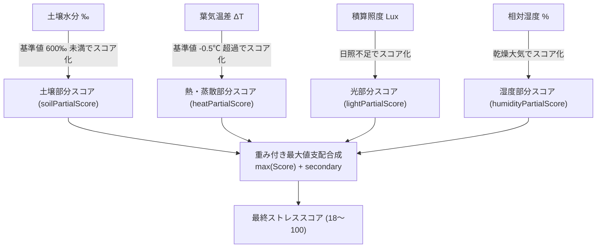

# 第2章 植物ストレス診断とバロメータ算出ロジック

本章では、Plant Doctor がリアルタイムに算出している **「植物ストレスバロメータ（0〜100）」** の数学的アルゴリズムと内部コードを徹底解説します。

特に、ユーザー様からいただいた以下の疑問：
> **「植物ストレス度は基本18で、葉温などを急激に変化させると100になり、元に戻すと数秒で18に戻る。これは正しい動作ですか？」**

に対して、結論から申し上げますと、**これは設計仕様通りであり、極めて正常かつ理想的な動作**です。その理由をコードと数式から解き明かしましょう。

---

## 2.1 ストレスバロメータの設計思想

Plant Doctor は、植物の体調を「OK（0）」か「NG（1）」かの2値で判定するのではなく、**人間用の健康診断や血圧計のように 0〜100 の連続値**としてスコア化します。

| スコア範囲 | 診断ステータス | 植物の状態 | システムの動作 |
|---|---|---|---|
| **0 〜 29** | 🟢 **HEALTHY (健全)** | 蒸散が活発で水分・環境ともに極めて良好 | **Solist-AI™ オンデバイス学習を自動実行** |
| **30 〜 59** | 🟡 **WATCH (要観察)** | 土壌の乾き始め、または大気の軽度乾燥 | AI学習を一時保留、経過観察 |
| **60 〜 79** | 🟠 **WARNING (注意)** | 水分不足または熱負荷による気孔閉鎖 | 自動給水ポンプのスタンバイ |
| **80 〜 100**| 🔴 **CRITICAL (深刻)**| 深刻な水切れ、または葉温異常過熱 | **自動給水を即時実行 / アラート発報** |

---

## 2.2 【謎解き ①】なぜ平常時のストレス値は「18」なのか？

`firmware/ml63q2557/PlantDoctorWorkspace/PlantDoctor/config/PlantDoctorConfig.h` を開くと、以下の定数定義があります。

```c
/* firmware/ml63q2557/.../config/PlantDoctorConfig.h:47 */
#define PLANT_DOCTOR_STRESS_BASE_SCORE   (18U)  /* 平常時ベーススコア (DEMO1: 18/100) */
```

### なぜ「0」ではなく「18」なのか？
1. **生体としての「安静時負荷（ベースライン）」の表現**:
   植物も生き物です。太陽の光を浴び、呼吸し、水を吸い上げる生命活動そのものに微小な代謝負荷が存在します。医学的・生体工学的に「完全な無負荷（ストレス0）」はあり得ません。
2. **センサー・システムの稼働確認（Liveness Indicator）**:
   もし平常値を「0」にしてしまうと、ダッシュボードを見たときに「システムが正常に生体を測定しているのか、それともセンサーが抜けて値が0になっているのか」が区別できません。18という明確なベース値があることで、システムが健全に生体監視中であることを直感できます。

### ベーススコアからのスケーリング数式
`PlantStress.c` では、各センサーから算出した環境・生体負荷（偏差 $\text{Deviation} \in [0, 100]$）を、次のようにベーススコアへ加算・スケーリングしています。

$$\text{FinalScore} = \text{Base} + \left( \frac{(100 - \text{Base}) \times \text{Deviation}}{100} \right)$$

ここで、$\text{Base} = 18$ です。
- **平常時（すべての環境・生体が快適で $\text{Deviation} = 0$ のとき）**:
  $$\text{FinalScore} = 18 + \frac{82 \times 0}{100} = \mathbf{18}$$
- **最大ストレス時（$\text{Deviation} = 100$ のとき）**:
  $$\text{FinalScore} = 18 + \frac{82 \times 100}{100} = \mathbf{100}$$

これが、普段モニタリング画面で植物ストレス度が「18」と表示されている数学的な根拠です。

---

## 2.3 4つの部分スコア（Partial Scores）の算出

Plant Doctor は、以下の4つの要素からそれぞれ $0 \sim 100$ の「部分スコア」を計算します。



### 1. 土壌水分部分スコア (`soilPartialScore`)
土壌水分が基準値（平常時 $600\text{‰} = 60\%$）を下回ると、乾燥度合いに比例して $0 \to 100$ へ上昇します。

### 2. 熱・蒸散部分スコア (`heatPartialScore`)
本プロジェクトの核心です。葉気温差 $\Delta T = T_{\text{leaf}} - T_{\text{air}}$ を評価します。
```c
/* PlantStress.c:84-96 */
if (features->leafAirTemperatureDelta > config->baselineTempDeltaCentiC) {
    int32_t diff = features->leafAirTemperatureDelta - config->baselineTempDeltaCentiC;
    int32_t score = (diff * 100L) / config->maxHeatDeltaRangeCentiC;
    if (score > 100L) score = 100L;
    output->heatPartialScore = (uint8_t)score;
}
```
- 平常基準（`baselineTempDeltaCentiC`）は **$-0.5^\circ\text{C}$**（葉が気温より $0.5^\circ\text{C}$ 冷たい状態）。
- 許容最大上昇幅（`maxHeatDeltaRangeCentiC`）は **$+2.0^\circ\text{C}$**。
- もし気孔が閉じて葉温が気温と同じ（$\Delta T = 0.0^\circ\text{C}$）になると、スコアは 25点。
- 葉温が気温より $+1.5^\circ\text{C}$ 以上高くなると、スコアは一気に **100点** に跳ね上がります。

---

## 2.4 【謎解き ②】なぜ葉温急変で「100」になり、数秒で「18」に戻るのか？

### ① 平均化しない「最大値支配（Max Dominance）」アルゴリズム
一般的なシステムでは、各指標のスコアを「平均」しがちです。しかし、平均化には致命的な弱点があります。
> **【平均化の罠】**
> 土壌水分が 100点（満水で快適）、光も快適（0点）、湿度も快適（0点）のとき、
> 葉がドライヤーや直射日光で熱せられて蒸散限界（100点）に達しても、
> 平均すると $(0 + 0 + 0 + 100) / 4 = 25\text{点}$ に薄まってしまい、植物が枯死するまでアラートが出なくなります。

これを防ぐため、`PlantStress.c` では **「最も深刻な単一ストレスを主軸とする（最大値支配）」** アルゴリズムを採用しています。

```c
/* PlantStress.c:126-184 要約 */
maxWeightedPartial = max(soil, heat, light, humidity);
deviation = maxWeightedPartial + (他の副次ストレスの加算);
finalScore = 18 + (82 * deviation) / 100;
```

葉に息を吹きかけたり、指で触れて葉温を急激に上げると、**`heatPartialScore` が単独で 100 に達します**。
最大値支配アルゴリズムにより、土壌が湿っていようと関係なく、合成偏差 $\text{Deviation}$ は即座に 100 になり、**最終スコアは瞬時に「100」へ振り切れます**。

### ② なぜ元に戻すと「数秒」で 18 に戻るのか？
Plant Doctor に搭載されている非接触赤外線サーモパイルセンサーは、葉から放射される赤外線を光学的に測定しており、**応答速度（時定数 $\tau$）が約 0.5〜1.0 秒**と非常に高速です。

1. 熱源（指や温風）を離すと、葉面温度の測定値は 1〜2秒で平常の室温（葉気温差 $-0.5^\circ\text{C}$ 前後）へ戻ります。
2. 次のセンシングサンプリング（1秒周期）で `features->leafAirTemperatureDelta` が基準値を下回ります。
3. `heatPartialScore` が即座に 0 に戻り、$\text{Deviation} = 0$ となります。
4. 数式通り、$\text{FinalScore} = 18 + 0 = \mathbf{18}$ へ直ちに復帰します。

これは、**センサーの即応性と、アルゴリズムのフェイルセーフ設計が完全に機能している証拠**です。

---

## 2.5 まとめ

| 現象 | 理由・メカニズム | 設計上の意図 |
|---|---|---|
| **基本値が 18** | `PLANT_DOCTOR_STRESS_BASE_SCORE` が 18 に設定されている | 生体の安静時代謝負荷を表現し、システムの生体監視稼働を可視化 |
| **葉温急変で 100** | 最大値支配アルゴリズムで `heatPartialScore` が支配 | 重大な単一ストレス（熱中症・蒸散障害）が他の要素で薄まらないようにする |
| **数秒で 18 に復帰** | 高速な赤外線応答性と 1秒周期の動的再評価 | 一時的な擾乱から回復した生体状態をタイムラグなく追従する |

ユーザー様が目撃された動作は、まさにこの高信頼・高感度な生体診断エンジンの理想的な振る舞いそのものです！

---

次章 **[第3章 自己符号化器（Autoencoder）と異常検知](03_autoencoder_and_anomaly_detection.md)** では、このルールベース診断を補完し、まだ人間がルール化できない潜在的病気や生体異常を発見する **AI（自己符号化器）** の世界へ踏み込みます！
