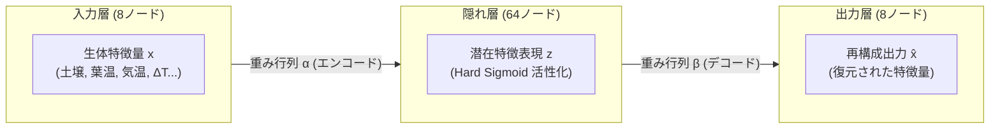
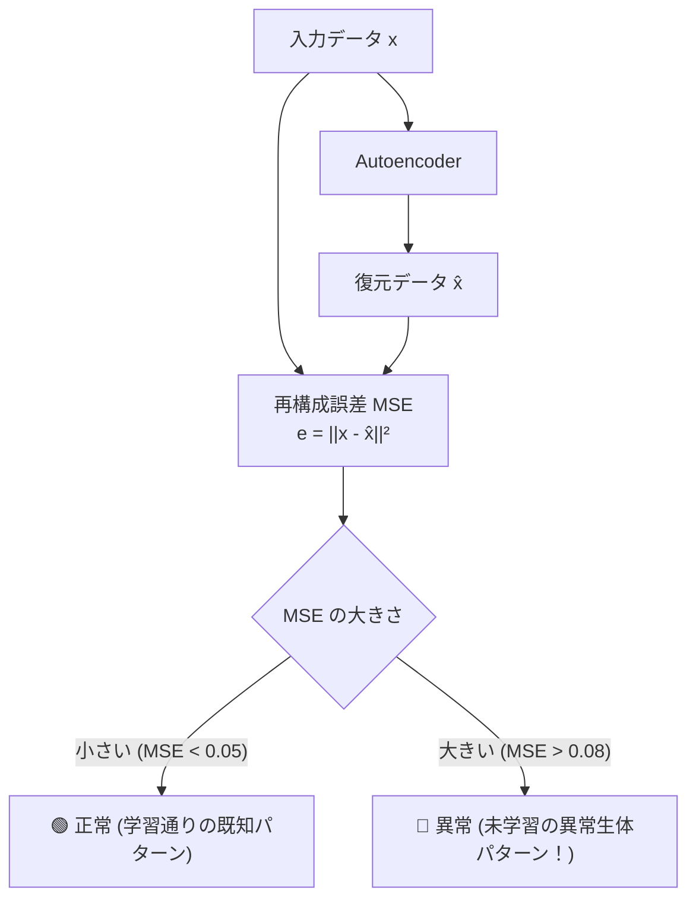

# 第3章 自己符号化器（Autoencoder）と異常検知の仕組み

第2章で学んだルールベース診断は、「葉温が上がった」「土が乾いた」という分かりやすい現象を即座に判定するのに適しています。
しかし、植物の病気や障害の初期症状は、もっと**「微妙で複雑な複数のセンサーの相関関係の崩れ」**として現れます。

本章では、ROHM ML63Q2557 内蔵の **Solist-AI™** が採用しているニューラルネットワーク技術 **「自己符号化器（Autoencoder）」** と、それを用いた **「教師なし異常検知（Unsupervised Anomaly Detection）」** のメカニズムを解説します。

---

## 3.1 ルールベースの限界と AI の必要性

従来の農業IoTシステムは、以下のような「しきい値ルール（If-Then）」で作られていました。
- `IF (土壌水分 < 20%) THEN ポンプを回す`
- `IF (気温 > 35℃) THEN 換気ファンを回す`

しかし、実際の植物の生態は単純なしきい値では捉えきれません。

> **【ケーススタディ：青枯病・根腐れの潜伏期】**
> - 土壌水分：十分（45%） $\to$ **ルール判定：正常**
> - 気温：快適（24℃） $\to$ **ルール判定：正常**
> - 日照：明るい昼（1500 Lux） $\to$ **ルール判定：正常**
> 
> しかし、根が細菌（青枯病菌）に侵されているため、強い光を受けているにもかかわらず吸水導管が詰まり、葉の蒸散冷却がわずかに鈍っている。
> 日照が急増した瞬間の「葉温の上昇スピード」と「土壌水分の減少スピード」のバランスが、通常の健康な日とわずかに食い違っている。

人間や単純なしきい値プログラムでは、8つのセンサー値の微小な共分散（相関関係のズレ）を同時に見抜くことは不可能です。
これを見つけ出すのが、多次元データを統合解析する **自己符号化器（Autoencoder）** です。

---

## 3.2 自己符号化器（Autoencoder: AE）とは何か？

自己符号化器とは、**「入力されたデータを一度ギュッと圧縮し、そこから元のデータを可能な限り正確に復元する」** ニューラルネットワークです。



### なぜ「入力をそのまま出力させる」のか？
一見すると、「入力した値と同じ値を復元するネットワークに何の意味があるのか？」と不思議に思えるかもしれません。

秘密は、中間層（隠れ層）の構造にあります。
入力された 8次元のデータは、そのまま直接出力されるのではなく、**ニューラルネットワークの複雑な非線形変換を通じて「健康な植物が保つべき8変数の物理的関係（相関関係の本質）」へと要約・圧縮**されます。
余計なノイズを捨て、本質的な特徴だけを取り出す「蒸留器」のような役割を果たすのです。

---

## 3.3 教師なし異常検知（Unsupervised Anomaly Detection）のアイデア

ディープラーニングの世界では、猫の画像を認識させるために「猫の画像1万枚」と「犬の画像1万枚」を集めて正解ラベルを与える「教師あり学習」が一般的です。

しかし、植物の病気診断において、この方法は使えません。
- **植物の病気は無数にある**: うどんこ病、青枯病、灰色かび病、線虫被害、根腐れ、微量要素欠乏症...。
- **異常のデータが手に入らない**: 現場で普段育てている植物は、大半が健康な状態です。あらゆる病気のセンサーログを事前に何万件も集めることは現実的ではありません。

そこで Solist-AI™ が採用したのが **「教師なし異常検知」** です。

```
【学習フェーズ】
  健康な植物のデータ（正常）だけを AI に見せて、
  「正常な時の8変数の関係」を完璧に復元（再構成）できるように訓練する。
                              │
                              ▼
【推論フェーズ】
  新しいセンサーデータが入力されたとき、
  AI に「復元してみろ」と命令する。
```



1. **正常なデータが来たとき**:
   AI はその相関パターン（日照が増えれば蒸散が増え、葉温は低く保たれ、土が適度に減る）を熟知しています。
   したがって、**入力と同じ値を綺麗に復元でき、再構成誤差（MSE）はほぼゼロ（0.01〜0.03）** になります。
2. **病気や水切れの異常データが来たとき**:
   AI はそんな崩れたパターンを学習したことがありません。
   AI は「正常時の知識」を使って無理やり復元しようとするため、**復元に大失敗し、再構成誤差（MSE）が跳ね上がり（0.10以上）ます**。

つまり、**「どんな病気か知らなくても、『いつもと違う』ことだけを絶対に見逃さない」** というのが、自己符号化器による異常検知の最大の強みなのです。

---

## 3.4 Solist-AI™ の 8次元生体特徴空間

Plant Doctor では、植物の生体を表現するために厳選された **8つの特徴量** を Autoencoder の入力として与えています。

| 次元 | 特徴量 | 単位 | 物理・生理学的意味 |
|---|---|---|---|
| **$x_0$** | **土壌水分量** | ‰ (0〜1000) | 根の周囲に存在する給水源の絶対量 |
| **$x_1$** | **葉面温度** | 0.01℃ | 葉の表面の熱放射温度（蒸散による冷却の直接指標） |
| **$x_2$** | **環境気温** | 0.01℃ | 周囲の空気温度 |
| **$x_3$** | **葉気温差 $\Delta T$** | 0.01℃ | $T_{\text{leaf}} - T_{\text{air}}$（蒸散活動の活発さ） |
| **$x_4$** | **相対湿度** | 0.01% | 大気の乾燥度（蒸散のしやすさ・飽差に関係） |
| **$x_5$** | **環境照度** | Lux | 光合成の駆動力（気孔を開くトリガー） |
| **$x_6$** | **葉温変化率** | 0.01℃/h | 葉面温度の単位時間あたり変動速度（環境変化への追従性） |
| **$x_7$** | **土壌水分変化率** | 1‰/h | 土壌から水が失われる速度（植物の吸水速度＋自然蒸発） |

これら8つの変数は互いに独立ではなく、物理法則（光合成・熱収支方程式・吸水導管流）によって強固に結びついています。Solist-AI™ はこの結合関係をネットワークの重みとして学習します。

---

## 3.5 再構成損失（MSE）の数学的定義

Autoencoder の性能と異常度を測る指標が、**平均二乗誤差（Mean Squared Error: MSE）** です。
入力ベクトルを $\mathbf{x} = [x_0, x_1, \dots, x_{D-1}]^T$、復元された出力ベクトルを $\hat{\mathbf{x}} = [\hat{x}_0, \hat{x}_1, \dots, \hat{x}_{D-1}]^T$ とすると（次元数 $D=8$）：

$$\text{MSE} = \frac{1}{D} \sum_{i=0}^{D-1} (x_i - \hat{x}_i)^2$$

- 各次元の「入力」と「復元出力」のズレを二乗し、全次元で平均をとったものです。
- **入力値が $0.0 \sim 1.0$ に正規化されている場合、MSE の理論上の値域は $[0.0, 1.0]$** となります。
- Plant Doctor の `plant-medical` ダッシュボードでは、この MSE をリアルタイムにプロットし、しきい値 **0.080** を超えた場合に「再構成誤差増大（Anomaly Alert）」を発令します。

---

次章 **[第4章 オンデバイス逐次学習（ODL）の全貌](04_on_device_learning_mechanism.md)** では、もう一つの重要な疑問：
> **「45,781回学習済みと表示され、1秒ごとに増えていくが、マイコンは45,781回分のデータを基板に保存しているのか？」**

について、数学の驚くべきブレークスルーとともに解き明かします！
