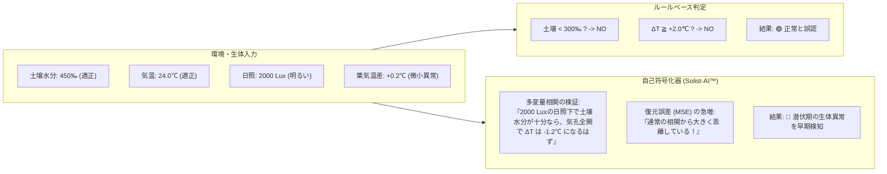
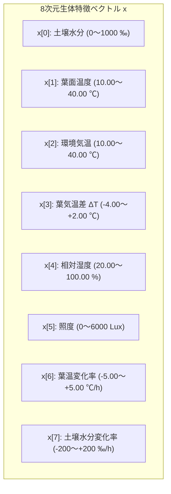
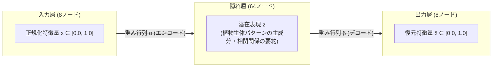

# 第3章 自己符号化器（Autoencoder）と多次元生体異常検知

第2章で解説したルールベース診断は、土壌の乾燥や極端な過熱といった「単一指標の閾値超過」を即座に判定する上で極めて有効です。

しかし、植物の病気（青枯病や灰色かび病）、害虫の食害、あるいは根腐れの超初期段階では、どの単一センサも警戒閾値を超えません。「日照が増えたのに葉温が下がるペースがわずかに鈍い」「気温が上がったのに土壌の減りがいつもと違う」といった、**「複数のセンサ値が織りなす相関関係（共分散）の微小な破綻」**として現れます。

本章では、ROHM ML63Q2557 内蔵の **Solist-AI™** が採用しているニューラルネットワーク技術 **「自己符号化器（Autoencoder）」** と、それを用いた多次元生体異常検知の数学的メカニズムについて詳細に解説します。

---

## 3.1 ルールベース診断の死角と教師なし異常検知の必然性

農業現場や植物モニタリングにおいて、従来型の If-Then ルールには越えられない壁があります。



### なぜ「正常データのみ」を学習するのか？
ディープラーニングの画像分類などでは、大量の「異常（病気）のデータ」を集めて正解ラベルを付与する教師あり学習が一般的です。しかし、植物の現場ではこの手法は通用しません。
1. **病気や障害のパターンが無数に存在する**: 根腐れ、うどんこ病、モザイク病、肥料焼け、微量要素欠乏など、異常の現れ方は無限にあります。
2. **現場で発生するデータの 99% 以上は「正常」である**: 現場で普段稼働している鉢植えにおいて、あらゆる病気のデータを事前に網羅することは不可能です。

そこで Solist-AI™ は、**「健康な状態のデータのみを学習し、未知のあらゆる異常をあぶり出す『教師なし異常検知（Unsupervised Anomaly Detection）』」** を採用しています。

---

## 3.2 8次元生体特徴量空間の物理的構造

Plant Doctor は、植物の生体状態と周辺微気象を網羅する **8次元の特徴量ベクトル $\mathbf{x} = [x_0, x_1, \dots, x_7]^T$** を構成し、AIモデルに入力します。



| 次元 | 物理特徴量名 | 計測レンジ（実数） | センシングの狙いと物理的意味 |
|---|---|---|---|
| **$x_0$** | **土壌水分** | $0 \sim 1000\text{ ‰}$ | 根圏の利用可能水分量。蒸散の供給源 |
| **$x_1$** | **葉面温度** | $10.00 \sim 40.00^\circ\text{C}$ | 葉の熱平衡状態（日射受熱と気化熱放熱の結果） |
| **$x_2$** | **環境気温** | $10.00 \sim 40.00^\circ\text{C}$ | 植物を取り巻く外気熱環境 |
| **$x_3$** | **葉気温差（$\Delta T$）** | $-4.00 \sim +2.00^\circ\text{C}$ | 気孔開閉と蒸散気化冷却の直接的バロメータ |
| **$x_4$** | **相対湿度** | $20.00 \sim 100.00\%\text{RH}$ | 大気飽差（VPD）を決定する蒸散駆動ポテンシャル |
| **$x_5$** | **照度** | $0 \sim 6000\text{ Lux}$ | 光合成活性と光受容体による気孔開口のトリガー |
| **$x_6$** | **葉温変化率** | $-5.00 \sim +5.00^\circ\text{C}/\text{h}$ | 急性熱ストレスや直射日光の急変に対する過渡応答 |
| **$x_7$** | **土壌水分変化率** | $-200 \sim +200\text{ ‰}/\text{h}$ | 根の吸水速度および土壌蒸発速度の動的トレンド |

静的なスナップショット（現在の温度や水分）だけでなく、**「時間あたりの変化率（動的動態）」** を特徴量に組み込むことで、環境変動に対する植物の動的応答の乱れを捉えることが可能になります。

---

## 3.3 入力正規化（NormalizeToQ8）と活性化関数の数学的整合性

組み込みニューラルネットワークにおいて、入力データのスケール（単位系）と活性化関数の値域を数学的に一致させることは、学習の収束と推論精度を担保するための絶対条件です。

### 1. 活性化関数（Hard Sigmoid）の値域
Solist-AI™ の出力層では、省電力マイコン上での高速実行に適した **Hard Sigmoid 活性化関数** が使用されています。

$$\text{HardSigmoid}(z) = \max\left(0.0, \min\left(1.0, 0.2z + 0.5\right)\right) \quad \in [\mathbf{0.0, 1.0}]$$

出力層ノードが Sigmoid であるため、**AIが復元（再構成）できる出力値 $\hat{x}_i$ は数学的に厳密に $[0.0, 1.0]$ の範囲内に制限**されます。

### 2. 固定小数点 $Q8$ 変換と正規化
もし入力データとして「湿度 $6000$（$60.00\%$）」や「葉温 $2500$（$25.00^\circ\text{C}$）」といった生データをそのまま入力し、単に $2^8 = 256$ で除算（$Q8$ 変換）するだけでは、$6000 / 256 = 23.4$ や $2500 / 256 = 9.8$ となり、最大でも $1.0$ までしか出力できない Sigmoid 関数と致命的なスケール不整合（Scale Mismatch）を起こします。

そこで `PlantAi.c` では、各物理量の物理的最小値（$\text{minVal}$）と最大値（$\text{maxVal}$）を $[0, 256]$（実数換算で $0.0 \sim 1.0$）へとクリップ付き線形スケーリングするインライン関数 `NormalizeToQ8` を導入しています。

```c
/* ai/PlantAi.c: 物理生値を Q8 形式の 0〜256 (実数 0.0〜1.0) に正規化 */
static inline int16_t NormalizeToQ8(int32_t val, int32_t minVal, int32_t maxVal) {
    if (val <= minVal) return 0;
    if (val >= maxVal) return 256;
    return (int16_t)(((val - minVal) * 256L) / (maxVal - minVal));
}
```

```c
/* 8次元特徴量の正規化実行コード */
int16_t rawFeatures[SOLIST_AI_FEATURE_DIM];
rawFeatures[0] = NormalizeToQ8(featureInput.soilMoisturePermille, 0, 1000);         /* 0〜1000 ‰ */
rawFeatures[1] = NormalizeToQ8(snapshot.leafTemperatureCentiC, 1000, 4000);        /* 10〜40 ℃ */
rawFeatures[2] = NormalizeToQ8(snapshot.airTemperatureCentiC, 1000, 4000);         /* 10〜40 ℃ */
rawFeatures[3] = NormalizeToQ8(s_featureVector.leafAirTemperatureDelta, -400, 200);/* -4〜+2 ℃ */
rawFeatures[4] = NormalizeToQ8(snapshot.relativeHumidityCentiPercent, 2000, 10000); /* 20〜100 % */
rawFeatures[5] = NormalizeToQ8(snapshot.illuminanceRaw, 0, 6000);                   /* 0〜6000 Lux */
rawFeatures[6] = NormalizeToQ8(s_featureVector.leafTemperatureRatePerHour, -500, 500);/* -5〜+5 ℃/h */
rawFeatures[7] = NormalizeToQ8(s_featureVector.soilMoistureRatePerHour, -200, 200);   /* -200〜+200 ‰/h */

/* bfloat16 浮動小数点配列へ一括変換 */
ODL_ToBfloat16(s_solistAiInput, rawFeatures, 8U, SOLIST_AI_FEATURE_DIM);
```

この正規化により、**すべての特徴量は $[0.0, 1.0]$ の無次元空間に射影され、Sigmoid 出力層の値域と完璧に合致します**。

---

## 3.4 自己符号化器の内部構造（8-64-8）と再構成誤差（MSE）

Solist-AI™ のニューラルネットワークは、3層構造の自己符号化器（Autoencoder）で構成されています。



### 再構成誤差（MSE: Mean Squared Error）の計算
入力された正規化特徴ベクトル $\mathbf{x}$ と、ニューラルネットワークが復元した出力ベクトル $\hat{\mathbf{x}}$ の二乗平均誤差を計算します。

$$\text{MSE} = \frac{1}{D} \sum_{i=0}^{D-1} (x_i - \hat{x}_i)^2 \quad (D = 8)$$

ファームウェア内部では、この浮動小数点誤差を $10,000$ 倍して整数化した PPM（Parts Per Million相当: $0 \sim 10000$）として扱い、テレメトリ経由で外部へ送信します。

```c
/* ai/PlantAi.c: 損失の取得とPPM整数化 */
bfloat16 loss = OSUAD_GetLoss();
float fLoss = 0.0f;
uint32_t rawLoss32 = ((uint32_t)(uint16_t)loss) << 16;
memcpy(&fLoss, &rawLoss32, sizeof(float));

/* NaN / Inf および飽和ガード */
if (((rawLoss32 & 0x7F800000UL) == 0x7F800000UL) || (fLoss > 1.0f)) {
    fLoss = 1.0f;
} else if (fLoss < 0.0f) {
    fLoss = 0.0f;
}
s_solistAiLatestLossPpm = (uint16_t)(fLoss * 10000.0f);
```

### 正常時と異常時の誤差挙動
1. **正常データ入力時（健康な植物）**:
   AI は学習を通じて「日照が高ければ気孔が開き、葉気温差は下がり、土壌水分は緩やかに減少する」という8変数の調和（多変量共分散）を記憶しています。したがって、入力されたデータを高精度に再構成でき、**MSE は $0.01 \sim 0.03$（PPM: 100〜300）という極小値に収束**します。
2. **生体異常データ入力時（病気・導管閉塞・未知のストレス）**:
   「日照が十分あるのに蒸散冷却が起きていない」「土壌水分が十分なのに葉温が異常に上昇している」といった不整合データが入力されると、AIが持つ正常知識ではこの歪んだ関係を復元できません。
   その結果、**再構成誤差（MSE）は $0.08 \sim 0.20$ 以上（PPM: 800〜2000以上）へと急激に跳ね上がり、潜在的な生体異常アラート（Anomaly Alert）として検知**されます。

---

## 📖 ナビゲーション

**[← 第2章 多変量植物ストレス評価と自律診断アルゴリズム](02_plant_stress_scoring.md)** ｜ [目次 (README)](README.md) ｜ **[第4章 オンデバイス逐次学習（ODL）の数学と実装アーキテクチャ →](04_on_device_learning_mechanism.md)**

