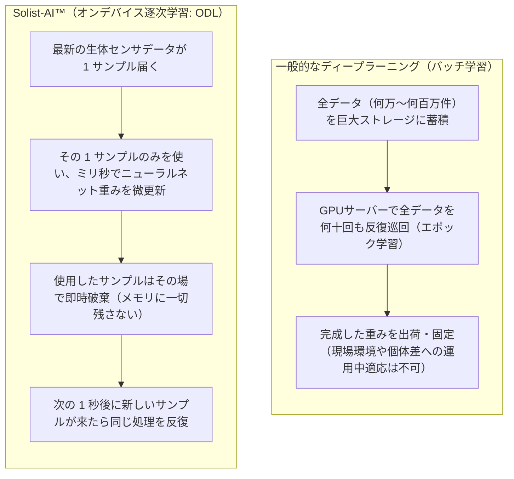
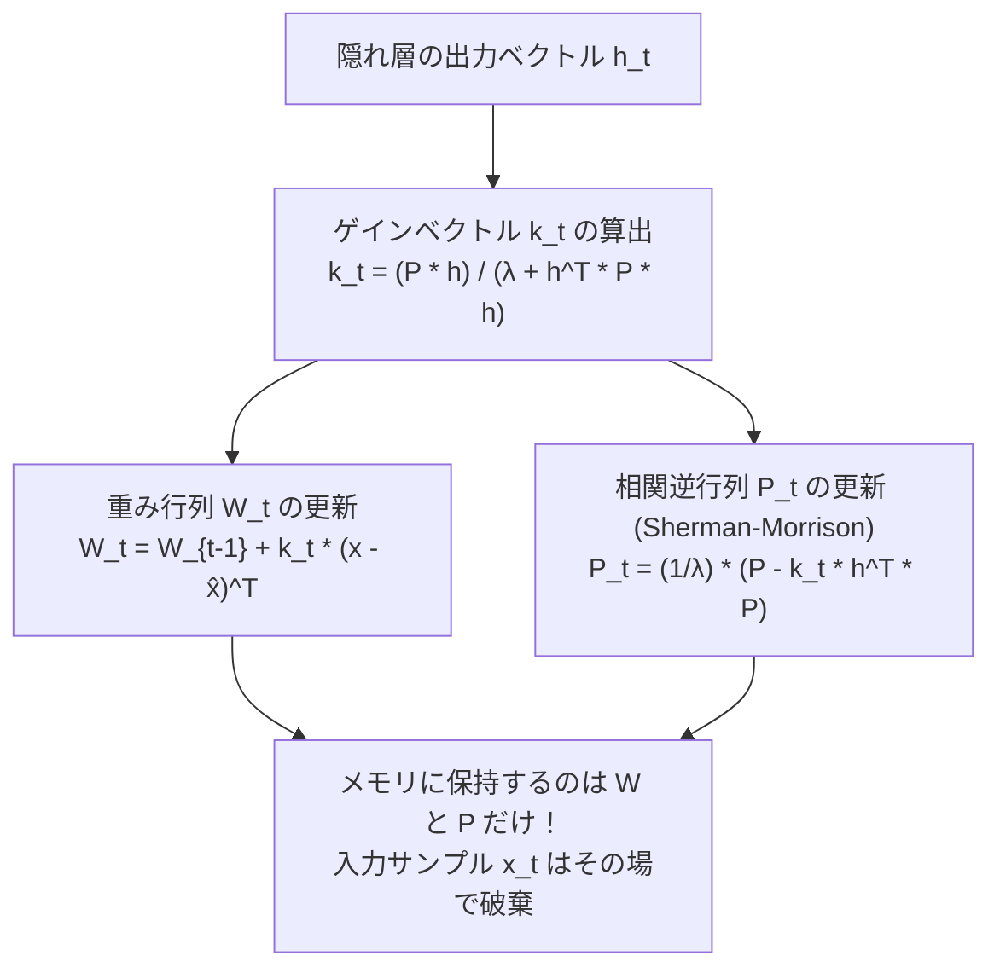
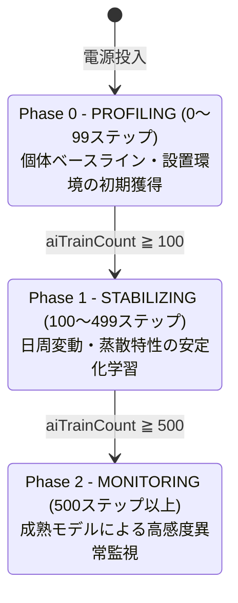
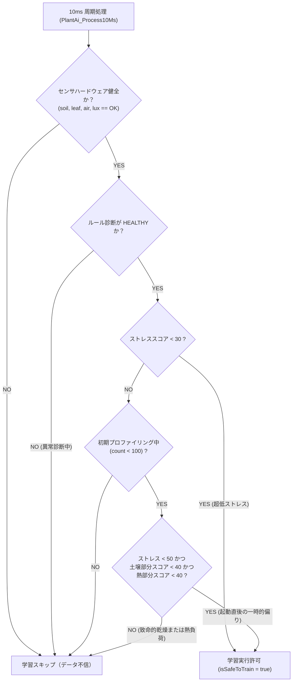

# 第4章 オンデバイス逐次学習（ODL）の数学と実装アーキテクチャ

ディープラーニングの世界では、何万件もの学習データをストレージに保存し、巨大なGPUサーバー上で何十時間もかけて最適化を行う「バッチ学習（Batch Learning）」が常識とされています。

しかし、ROHM ML63Q2557 の内蔵 RAM はわずか **32KB** です。もし過去のセンシングデータを何万回分もマイコン内に保存しようとすれば、数時間でメモリが枯渇しシステムが破綻します。

本章では、過去のデータを一切保存することなく、メモリ消費量 $O(1)$ で何万回もの機械学習を継続できる数学的ブレークスルー **「逐次最小二乗法（Recursive Least Squares: RLS）」** と、現場での長期運用を支える多層防御インターロックについて解説します。

---

## 4.1 バッチ学習とデータ非保持型逐次学習（Online Sequential Learning）

組み込み機器において機械学習を実行する際、データの扱い方は従来のアプローチと根本から異なります。



| 比較項目 | クラウド・GPU型 バッチ学習 | Solist-AI™ オンデバイス逐次学習 (ODL) |
|---|---|---|
| **過去データの蓄積** | **必須**（大容量SSDやデータベースが不可欠） | **不要（過去データは1件も保存せず即時破棄）** |
| **学習の実行場所** | 遠隔地のデータセンター (GPUサーバー) | **植物の鉢に挿したマイコンチップ内部** |
| **必要RAM容量** | 数GB 〜 数十GB | **数KB 〜 数十KB（RAM 32KBマイコンで余裕）** |
| **適応性 (Adaptability)**| 出荷時のモデルから変化しない（静的） | **個体差、設置環境、季節変化に自律適応（動的）** |
| **計算複雑度** | $O(N \cdot M)$（データ件数 $N$ に比例して増大）| **$O(1)$（データ件数に依存せず常に一定）** |

### メモリ消費量 $O(1)$ の工学的意義
センサのサンプリング周期は 1.0秒（1Hz）です。仮に 24時間（86,400秒）動かすと 86,400 サンプルのデータが生成されます。これを素朴に保存しようとすれば約 $1.38\text{MB}$ のメモリが必要となり、32KB のマイコンでは到底保持できません。
逐次学習では、到着した 1 サンプルの情報を行列演算によって即座に内部パラメータへ吸収・統合し、サンプルそのものは破棄するため、**何年稼働させてもメモリ使用量は 1 バイトたりとも増えません**。

---

## 4.2 逐次最小二乗法（Recursive Least Squares: RLS）の数学

過去のデータを保存しないにもかかわらず、過去の経験をすべて記憶し続けられる秘密は、信号処理や適応制御理論で用いられる **「逐次最小二乗法（RLS）」** と **「シャーマン・モリソンの公式（Sherman-Morrison Formula）」** にあります。



### 1. 状態変数：重み行列 $\mathbf{W}$ と 相関逆行列 $\mathbf{P}$
ニューラルネットワークの隠れ層（64ノード）の出力を $\mathbf{h}_t \in \mathbb{R}^{64}$、目標出力（入力特徴量の復元値）を $\mathbf{x}_t \in \mathbb{R}^8$ とします。
マイコンが内部メモリに保持し続けるのは、以下の固定サイズ変数のみです：
1. **重み行列 $\mathbf{W} \in \mathbb{R}^{64 \times 8}$**: AIが獲得した現在の結合強度（知識）。
2. **相関逆行列 $\mathbf{P} \in \mathbb{R}^{64 \times 64}$**: 過去に入力されたすべての特徴ベクトルの分散・共分散情報の要約（自己相関行列の逆行列）。

### 2. 更新ステップの計算アルゴリズム
時刻 $t$ において、新しい生体サンプル $\mathbf{x}_t$ が到着した瞬間、マイコン内部では以下のステップが実行されます。

#### ステップ 1：ゲインベクトル $\mathbf{k}_t$ の計算
新しい入力が現在の知識に対してどれだけ新規性（重みを修正すべき度合い）を持っているかを計算します：

$$\mathbf{k}_t = \frac{\mathbf{P}_{t-1} \mathbf{h}_t}{\lambda + \mathbf{h}_t^T \mathbf{P}_{t-1} \mathbf{h}_t}$$

分母はスカラー値となるため、高コストな行列の逆行列計算（通常 $O(N^3)$ の計算量）が不要であり、単純な除算で求まります。

#### ステップ 2：再構成誤差に基づく重み行列 $\mathbf{W}_t$ の更新
現在の復元値 $\hat{\mathbf{x}}_t$ と真値 $\mathbf{x}_t$ の誤差ベクトルにゲインを乗じ、重みを修正します：

$$\mathbf{W}_t = \mathbf{W}_{t-1} + \mathbf{k}_t (\mathbf{x}_t - \hat{\mathbf{x}}_t)^T$$

#### ステップ 3：相関逆行列 $\mathbf{P}_t$ の更新（シャーマン・モリソンの公式）
新しいサンプルの分散情報を、相関逆行列へと織り込みます：

$$\mathbf{P}_t = \frac{1}{\lambda} \left( \mathbf{P}_{t-1} - \mathbf{k}_t \mathbf{h}_t^T \mathbf{P}_{t-1} \right)$$

この3式の計算が完了した瞬間、サンプル $\mathbf{x}_t$ が持っていた統計情報はすべて $\mathbf{W}_t$ と $\mathbf{P}_t$ の中に完全に凝縮されます。したがって、**$\mathbf{x}_t$ を即座に破棄しても、学習結果に一切の情報の欠落は生じません**。

---

## 4.3 忘却係数（Forgetting Factor $\lambda$）と長期運用の安定性

数式中のパラメータ $\lambda$（$0 < \lambda \le 1$）は **忘却係数（Forgetting Factor）** と呼ばれます。

- $\lambda < 1.0$（例: $0.95$）の場合、過去のサンプルの重みが指数関数的に減衰し、最新のデータに敏感に追従するようになります。
- しかし、植物モニタリングのように何ヶ月も連続稼働させる場合、$\lambda < 1.0$ を適用し続けると、入力データが安定している期間に $\mathbf{P}$ 行列の固有値が無限に増大し、数値がオーバーフローする「共分散ワインドアップ（Covariance Wind-up）」という現象が発生します。

### 本システムのパラメータ設計
`PlantAi.c` では、長期的な数値安定性と堅牢性を最優先し、忘却係数を厳密な **$\lambda = 1.0$（bfloat16: `0x3F80`）** に設定しています。

```c
/* ai/PlantAi.c:116 */
s_solistAiParams.forgettingFactor = 0x3F80; /* 1.0 (bfloat16) - prevents RLS covariance wind-up */
```

これにより、長期間の無停止連続稼働においても行列の数値発散が物理的に抑止され、安定した生体監視が継続されます。

---

## 4.4 3段階の自律学習フェーズ（Phase 0 / 1 / 2）

Plant Doctor のオンデバイス学習は、電源投入直後から定常運用に至るまで、累積学習回数（`aiTrainCount`）に応じて3つのフェーズを自動的に遷移します。



```c
/* ai/PlantAi.c: 学習フェーズ判定コード */
++s_solistAiTrainCount;
if (s_solistAiTrainCount < 100U) {
    s_solistAiPhase = 0U; /* PROFILING */
} else if (s_solistAiTrainCount < 500U) {
    s_solistAiPhase = 1U; /* STABILIZING */
} else {
    s_solistAiPhase = 2U; /* MONITORING */
}
```

1. **Phase 0: PROFILING（初期プロファイリング期: 0〜99ステップ）**:
   電源を入れて最初の約100秒間です。植えられている植物の初期土壌水分や、設置された部屋の基本温湿度といった「その環境固有のベースライン」を急速学習します。
2. **Phase 1: STABILIZING（安定化学習期: 100〜499ステップ）**:
   稼働開始から数分〜数十分の段階です。エアコンの風や光の変化に対する微小な変動パターンを学習し、ニューラルネットワークの再構成損失（MSE）が滑らかに低下していきます。
3. **Phase 2: MONITORING（定常監視期: 500ステップ以上）**:
   十分な学習を完了し、モデルの結合強度が最適値に収束した成熟フェーズです。この段階に達すると、AIは正常な生体リズムを完全に熟知しているため、微小な異常パターンに対しても鋭敏に MSE が反応するようになります。

---

## 4.5 多層防御安全インターロックと数値発散自己修復機構

機械学習において最も恐ろしい事態は、**「植物が病気や水切れで苦しんでいる異常時のデータを、誤って『正常』として学習してしまうこと（データ汚染 / Catastrophic Forgetting）」** です。異常を正常として覚えてしまえば、AIは二度と異常を検知できなくなります。

これを防ぐため、`PlantAi.c` は学習実行の直前に厳格な**安全インターロック判定（`isSafeToTrain`）**を実施します。



### 1. 多層防御安全インターロックの実装
```c
/* ai/PlantAi.c:250-264 */
bool isSafeToTrain = false;
if (s_diagnosisState.status == PLANT_STATUS_HEALTHY &&
    healthReport.soilHealth == SENSOR_HEALTH_OK &&
    healthReport.leafHealth == SENSOR_HEALTH_OK &&
    healthReport.airHumHealth == SENSOR_HEALTH_OK &&
    healthReport.luxHealth == SENSOR_HEALTH_OK) {
    if (s_stressScore < 30U) {
        isSafeToTrain = true;
    } else if ((s_solistAiTrainCount < 100U) &&
               (s_stressScore < 50U) &&
               (stressOutput.soilPartialScore < 40U) &&
               (stressOutput.heatPartialScore < 40U)) {
        isSafeToTrain = true;
    }
}
```

- **定常運用時**: ストレススコアが **30未満（完全健全域）** であり、かつ全センサが通信正常であるときのみ学習を行います。水切れや熱負荷が少しでも生じている間は、学習ゲートが完全に遮断されます。
- **初期プロファイリング期の安全緩和**: システム起動直後は、24時間積算照度の立ち上がり途上であることや、土壌の初期状態により、一時的にストレススコアが 30〜45 付近を示すことがあります。この初期段階に限り、致命的な土壌乾燥や熱ストレス（部分スコア $\ge 40$）が存在しないことを条件に総合閾値を 50 まで緩和し、スムーズなベースライン獲得を実現しています。

### 2. 数値発散ウォッチドッグ（Divergence Guard）による自律復旧
万が一、極端な外乱ノイズ等によってニューラルネットワーク内部の数値計算が飽和・発散した場合に備え、自律的な自己修復機構を搭載しています。

```c
/* ai/PlantAi.c: 数値発散ウォッチドッグ */
if (fLoss >= 1.0f) {
    if (++s_solistAiDivergenceCount >= 10U) {
        /* 健全状態にもかかわらず損失最大(1.0)が10周期連続した場合は自律リセット */
        OSUAD_Initialize(&s_solistAiParams, 1U);
        s_solistAiDivergenceCount = 0U;
        s_solistAiLatestLossPpm = 250U;
    }
} else {
    s_solistAiDivergenceCount = 0U;
}
```

植物が健全であるにもかかわらず、再構成損失が最大値（1.0）に張り付いた状態が 10秒連続した場合、システムは計算異常と判断して `AI_PERI` の学習パラメータを自律初期化し、即座に健全な再プロファイリングへと復帰します。

---

## 📖 ナビゲーション

**[← 第3章 自己符号化器（Autoencoder）と多次元生体異常検知](03_autoencoder_and_anomaly_detection.md)** ｜ [目次 (README)](README.md) ｜ **[第5章 システム統合・通信テレメトリと生体コックピット →](05_system_integration_and_telemetry.md)**

