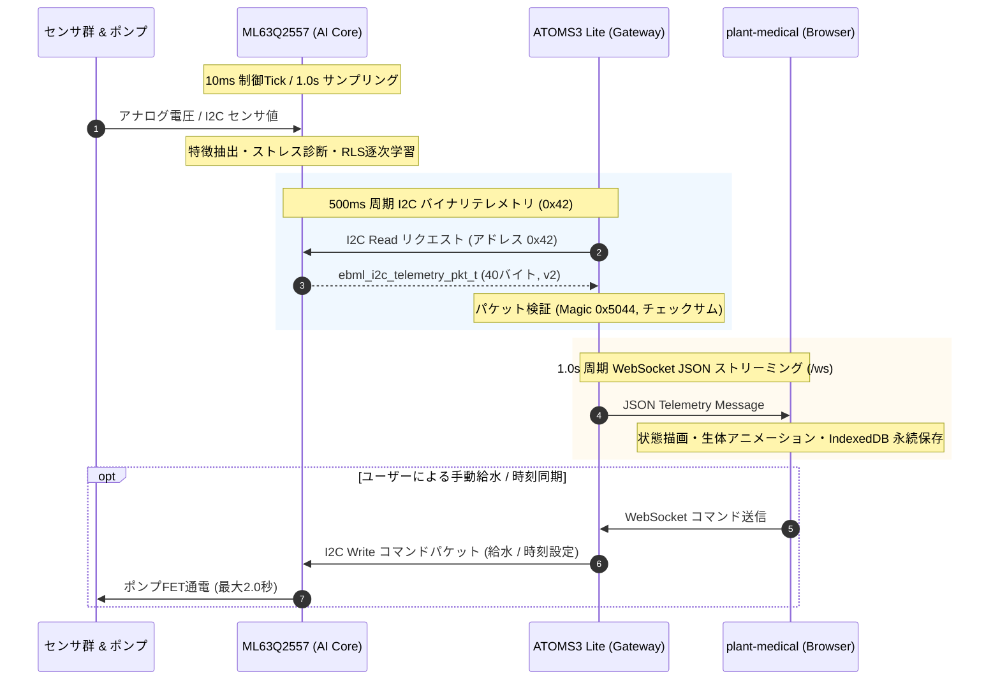
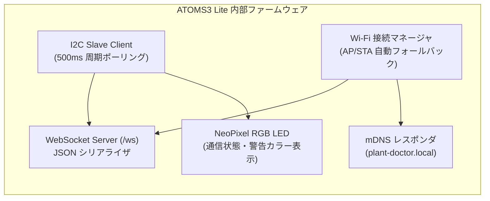
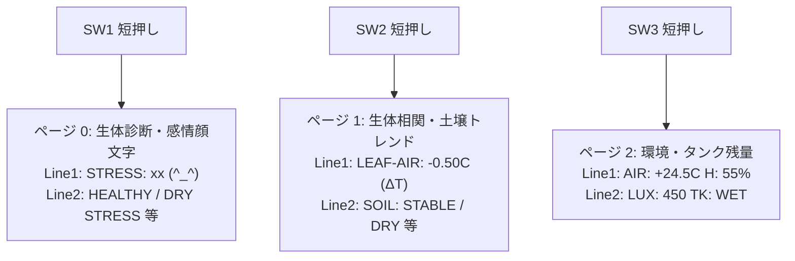
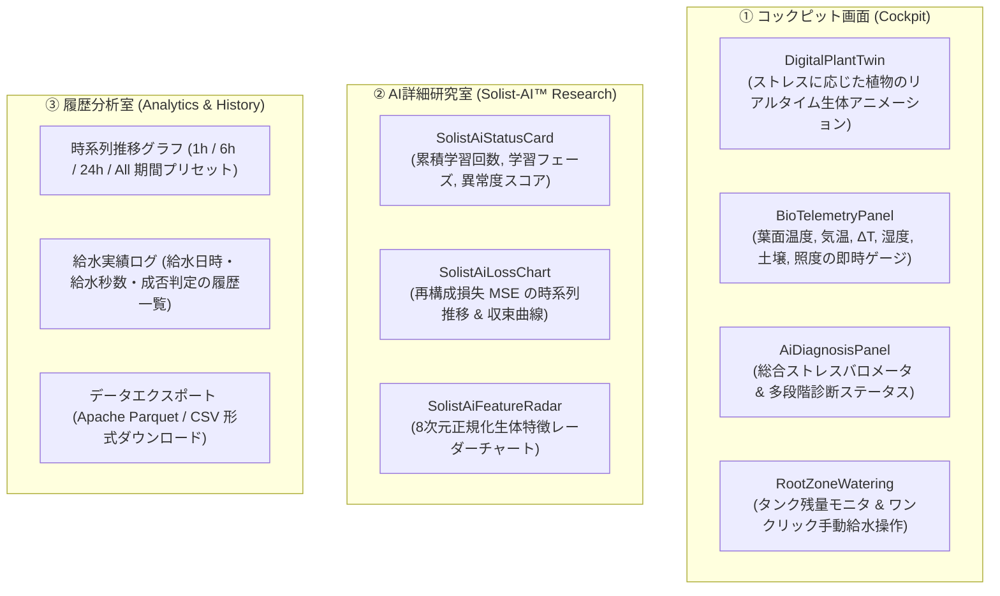

# 第5章 システム統合・通信テレメトリと生体コックピット

第1章から第4章までで、ROHM ML63Q2557 マイコン内部で完結する生体センシング、植物ストレス診断、そしてオンデバイス学習の理論と実装を学んできました。

しかし、植物と人間が真の意味で対話し、遠隔から生育環境を見守るためには、マイコンが捉えた高精度な生体情報を安全・確実に外部へと中継し、直感的なユーザー体験（UX）へと昇華させる「システム統合」が重要な役割を担います。

本章では、エッジマイコンからクラウドレスでブラウザまでを繋ぐ **I2Cバイナリテレメトリプロトコル（v2）**、ESP32-S3 による **ATOMS3 Lite 通信ゲートウェイ**、現地の物理 **LCD 16x2 / スイッチUI**、そして最新の Web 生体ダッシュボード **「plant-medical (Biological Cockpit)」** の全貌を解説します。

---

## 5.1 3段ハイブリッドシステムの全体協調とデータフロー

Plant Doctor は、堅牢な物理保護を担うエッジから、リッチな時系列解析を提供するWebフロントエンドまで、以下のデータパイプラインで有機的に結合されています。



マイコン（ML63Q2557）はリアルタイム制御とAI演算に専念し、重いTCP/IPプロトコルスタックやWi-Fi暗号化処理はゲートウェイ（ESP32-S3）にオフロードします。これにより、ネットワークの輻滞や切断が起きても、植物の生命維持制御は 1 ミリ秒の遅延もなく継続されます。

---

## 5.2 I2Cバイナリテレメトリプロトコル（v2）の詳細仕様

ML63Q2557 と ATOMS3 Lite の間は、基板間通信として最も堅牢かつ配線数の少ない **I2C バス（スレーブアドレス: `0x42`）** で接続されています。

テキスト形式（JSON等）ではなく、構造体アライメントを 1 バイト単位でパッキングした高効率なバイナリパケット **`ebml_i2c_telemetry_pkt_t`** を採用しています。

```c
/* inc/PlantDoctorI2cProto.h: I2C テレメトリパケット定義 (v2) */
#define EBML_I2C_SLAVE_ADDR        0x42
#define EBML_I2C_PKT_MAGIC         0x5044   /* 'P', 'D' */
#define EBML_I2C_PKT_VERSION       2

#pragma pack(push, 1)
typedef struct {
    uint16_t magic;                     /* 0x5044 (固定マジックナンバー) */
    uint8_t  version;                   /* プロトコルバージョン (2) */
    uint8_t  length;                    /* パケット長 (40 バイト) */
    uint32_t sampleSequence;            /* サンプル累積シーケンス番号 */
    uint16_t soilMoistureRaw;           /* 土壌水分 ADC 生値 (0-4095) */
    int16_t  leafTemperatureCentiC;     /* 葉面温度 [1/100 ℃] */
    int16_t  airTemperatureCentiC;      /* 環境気温 [1/100 ℃] */
    uint16_t relativeHumidityCentiPercent; /* 相対湿度 [1/100 %] */
    uint16_t illuminanceRaw;            /* 照度 [Lux] */
    uint8_t  tankLiquidDetected;        /* 給水タンク残水 (1: あり, 0: 空) */
    uint8_t  pumpOn;                    /* 給水ポンプ動作状態 (1: ON, 0: OFF) */
    uint8_t  stressScore;               /* 総合ストレススコア (0-100) */
    uint8_t  statusCode;                /* 診断ステータスコード (0: HEALTHY 等) */
    uint8_t  soilTrendCode;             /* 土壌トレンドコード (1: STABLE 等) */
    
    /* Solist-AI™ オンデバイス学習特化メトリクス */
    uint16_t aiTrainCount;              /* 累積学習ステップ数 */
    uint16_t aiLossPpm;                 /* 最新再構成損失 (0〜10000 PPM) */
    uint8_t  aiPhase;                   /* 学習フェーズ (0:Profiling, 1:Stabilizing, 2:Monitoring) */
    uint8_t  aiAnomalyScore;            /* 異常度スコア (0-100) */
    int16_t  leafTempRatePerHour;       /* 葉温変化率 [1/100 ℃/h] */
    int16_t  soilMoistureRatePerHour;   /* 土壌水分変化率 [‰/h] */

    uint16_t checksum;                  /* 16-bit 加算チェックサム */
} ebml_i2c_telemetry_pkt_t;
#pragma pack(pop)
```

### パケット完全性の検証（16-bit 加算チェックサム）
ノイズの多い現場環境でのデータ化けを防ぐため、パケットの末尾 2 バイトには、先頭からチェックサム直前までの全バイトを加算した 16-bit チェックサムが付与されます。

$$\text{checksum} = \sum_{i=0}^{L-3} \text{packet}[i] \pmod{2^{16}}$$

受信側の ESP32-S3 は、マジックナンバー（`0x5044`）、バージョン（`2`）、パケット長（`40`）、およびチェックサムの全条件が一致した場合のみ有効な生体データとして受理します。

---

## 5.3 ATOMS3 Lite ゲートウェイの機能と役割

ATOMS3 Lite（ESP32-S3FN8 搭載）は、物理的な植物生体信号をサイバー空間へと橋渡しする「エッジ通信ゲートウェイ」として機能します。



1. **ゼロコンフィグアクセス（mDNS）**:
   Wi-Fi ネットワークに参加後、`plant-doctor.local` というドメイン名を自律ブロードキャストします。ユーザーはいちいちルーターの管理画面を開いてIPアドレスを調べる必要がなく、ブラウザに `http://plant-doctor.local` と入力するだけで即座に接続できます。
2. **WebSocket リアルタイム配信**:
   ポート `80`（HTTP）および `/ws`（WebSocket）サーバーを内蔵しています。ブラウザが開かれると、1秒に1回のペースでバイナリテレメトリを整形した JSON メッセージを全クライアントへプッシュ配信します。
3. **RGB LED（NeoPixel）によるステータス可視化**:
   基板中央のフルカラーLEDにより、ゲートウェイ自体の稼働状態を直感的に把握できます。
   - 🟢 **緑点滅**: 正常稼働中・ML63Q2557 との通信確立
   - 🔵 **青点滅**: Wi-Fi 接続試行中
   - 🔴 **赤点灯**: I2C 通信エラーまたはセンサ断線警告

---

## 5.4 ローカル LCD 16x2 とハードウェアUI操作体系

Plant Doctor のマイコン基板（DT-EBML63Q2557）には、PCやスマートフォンが手元にない現場でも即座に状態が確認できるよう、**16文字 × 2行のキャラクタLCD** と **4つのタクトスイッチ（SW1〜SW4）** が搭載されています。

```
+──────────────────────────+
|  STRESS:  2 (^_^)        | <- 1行目: ストレス値と顔文字
|  HEALTHY                 | <- 2行目: 診断ステータス
+──────────────────────────+
```

### 1. SW1〜SW3 による表示ページ手動切り替え
画面は3つのページで構成され、スイッチ操作によっていつでも切り替えられます。



### 2. ストレス感情顔文字（Emoticon）による直感表示
LCD 1行目の右端には、ストレススコアに応じた5文字の感情表現アスキーアートがリアルタイム描画されます。

| ストレススコア | 表示顔文字 | 植物の気持ち | 意味 |
|---|:---:|---|---|
| **0 〜 25** | `(^_^)` | 「快適！すくすく育っています」 | 蒸散快調・完全健全 |
| **26 〜 50** | `(-_-)` | 「ちょっと喉が渇いたかも…」 | 軽度ストレス・要観察 |
| **51 〜 75** | `(>_<)` | 「苦しい！水をください！」 | 気孔閉鎖・ストレス警戒 |
| **76 〜 100**| `(X_X)` | 「もう限界…倒れそうです！」 | 深刻な水切れ・熱過熱 |

### 3. SW4 による手動給水トグルと安全インターロック
- **短押し（給水停止時）**: ポンプが起動し、定量（約20ml / 2.0秒）の給水を開始します（`WATERING 2.0s` 表示）。
- **短押し（給水動作中）**: 任意のタイミングで即座に給水を強制緊急停止できます（`PUMP STOPPED` 表示）。
- **フェイルセーフ通知**: タンクに水がない場合は `TANK EMPTY!`、前回の給水から時間が経過していない場合は `PUMP COOLDOWN` と表示され、誤作動を完全に防止します。

### 4. デモモード機能（SW1 長押し）
展示会やプレゼンテーションにおいて、意図的に乾燥や熱ストレス状態を疑似再現できるよう、**SW1 を 3.0秒以上長押し** することで「デモモード」へ移行します。デモモード中は画面上にアスタリスク `*` が点灯し、安全に各機能のデモンストレーションが可能です。

---

## 5.5 plant-medical（Biological Cockpit）ダッシュボード

Webダッシュボード **「plant-medical」** は、植物を単なる測定対象ではなく「ひとつの生命（患者）」として捉える、診察室型コックピットUIです。



### 1. デジタルプラントツイン（Digital Plant Twin）
画面中央には、植物のリアルタイムな生理状態を反映するインタラクティブな植物モデルが配置されます。
- ストレススコアが低い健全時は、葉がいきいきと緑に輝き、蒸散を表す柔らかなアニメーションが流れます。
- ストレスが上昇すると、葉が徐々に黄色から茶色へと変色し、萎れて垂れ下がるアニメーションへとシームレスに変化します。

### 2. 8次元生体特徴レーダーチャート（SolistAiFeatureRadar）
正規化された 8つの特徴量（土壌、葉温、気温、$\Delta T$、湿度、照度、葉温変化率、土壌変化率）を、正八角形のレーダーチャートとして描画します。
- 健全時はバランスの取れた均整な形状を保ちますが、異常が発生すると特定の特徴軸が大きく突出し、どのセンサが相関崩れの原因になっているのかが一目で直感できます。

### 3. ブラウザ内蔵 IndexedDB による完全ローカル永続保存
一般的なWebシステムとは異なり、クラウドデータベースを必要としません。
- ブラウザ内部の高速ストレージ **IndexedDB（PlantMedicalDB）** に、受信したテレメトリを秒単位で直接保存します。
- 過去の任意の時刻のタイムラインをスクロール（スクラバー操作）することで、数時間前の植物の体調変化を正確に再生・追体験できます。
- 蓄積されたデータは、分析用の標準形式である **Apache Parquet** や **CSV** としてワンクリックでダウンロード可能です。

---

## 📖 ナビゲーション

**[← 第4章 オンデバイス逐次学習（ODL）の数学と実装アーキテクチャ](04_on_device_learning_mechanism.md)** ｜ [目次 (README)](README.md)

