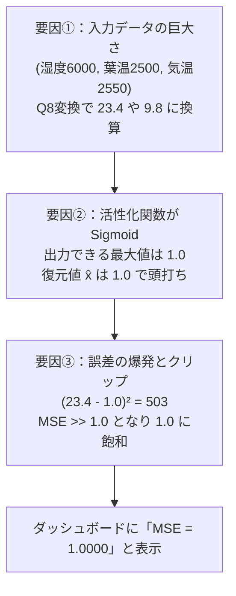

# 第5章 実機トラブルシューティング：なぜMSEが常に1になったのか？

本章では、ユーザー様が実機モニタリングで遭遇された最大の謎：
> **「再構成損失 (MSE）が常に 1 で、再構成誤差増大 (Anomaly Alert) が出ているけど何で？」**

という疑問について、マイコンの固定小数点演算（Fixed-Point Math）とニューラルネットワークの数学的構造からその原因を完全解剖します。
これは組み込みAI（TinyML）の開発現場で最も典型的に起こる**「スケール不整合（Scale Mismatch）」**の実例であり、非常に学びの多いテーマです。

---

## 5.1 現象の整理

`plant-medical` ダッシュボードを動かした際、以下の状態が観察されました：
- **累積学習回数**: 45,781回（順調に1秒ごとに増加）
- **再構成損失 (MSE)**: **常に `1.0000`（または `1`）に張り付いている**
- **ステータスバッジ**: 常に赤色の **「再構成誤差増大 (Anomaly Alert)」** が点灯している

学習回数は正常に増えているのに、なぜ再構成損失が全く下がらず、常に最大値（1.0）のままだったのでしょうか？

---

## 5.2 根本原因の完全解剖（3つの要因の連鎖）

調査の結果、**3つの技術的要因が連鎖して発生**していたことが判明しました。



### 要因 ①：固定小数点 $Q8$（256除算）と生センサー値のスケール
`firmware/ml63q2557/.../PlantAi.c` のコードを見てみましょう。

```c
/* PlantAi.c の変換コード */
int16_t rawFeatures[SOLIST_AI_FEATURE_DIM];
rawFeatures[0] = (int16_t)featureInput.soilMoisturePermille;          /* 例: 500 (‰) */
rawFeatures[1] = (int16_t)snapshot.leafTemperatureCentiC;             /* 例: 2500 (25.00℃) */
rawFeatures[2] = (int16_t)snapshot.airTemperatureCentiC;              /* 例: 2550 (25.50℃) */
rawFeatures[3] = (int16_t)s_featureVector.leafAirTemperatureDelta;    /* 例: -50 (-0.50℃) */
rawFeatures[4] = (int16_t)snapshot.relativeHumidityCentiPercent;      /* 例: 6000 (60.00%) */
rawFeatures[5] = (int16_t)snapshot.illuminanceRaw;                    /* 例: 1000 (Lux) */
rawFeatures[6] = (int16_t)s_featureVector.leafTemperatureRatePerHour; /* 例: -20 (-0.20℃/h) */
rawFeatures[7] = (int16_t)s_featureVector.soilMoistureRatePerHour;     /* 例: -15 (-15‰/h) */

/* Q8 フォーマットで bfloat16 浮動小数点配列へ変換 */
ODL_ToBfloat16(s_solistAiInput, rawFeatures, 8U, SOLIST_AI_FEATURE_DIM);
```

第3引数の `8U` は **$Q8$ 固定小数点フォーマット** を意味します。
$Q8$ は数値を **$2^8 = 256$ で割る** ことで実数に変換します。
すると、ニューラルネットワークに入力される数値は以下のようになります：

- **湿度（6000）**: $6000 \div 256 = \mathbf{23.43}$
- **葉温（2500）**: $2500 \div 256 = \mathbf{9.76}$
- **気温（2550）**: $2550 \div 256 = \mathbf{9.96}$
- **照度（1000）**: $1000 \div 256 = \mathbf{3.90}$
- **土壌（500）**: $500 \div 256 = \mathbf{1.95}$
- **葉気温差（-50）**: $-50 \div 256 = \mathbf{-0.19}$

### 要因 ②：活性化関数が Sigmoid（値域 $[0, 1]$）だった
ニューラルネットワークの初期化パラメータを確認すると：

```c
/* PlantAi.c:103 */
params.activationFunction = ODL_ACTV_SIGMOID; /* Hard Sigmoid 関数 */
```

Hard Sigmoid 関数の出力式は以下の通りです：
$$\text{HardSigmoid}(z) = \max(0, \min(1, 0.2z + 0.5)) \quad \in [\mathbf{0.0, 1.0}]$$

出力層のノードが Sigmoid であるため、**AIが復元できる出力値 $\hat{x}$ は最大でも $1.0$ まで** です。
しかし、目標入力値 $x$ は **23.43** や **9.76** です。

AIがどれだけ賢くても、**最大 1.0 しか出せない口から 23.43 という値を復元することは物理的・数学的に絶対に不可能**です！
その結果、湿度1項目だけでも：
$$(x_4 - \hat{x}_4)^2 = (23.43 - 1.0)^2 = \mathbf{503.1}$$
という桁外れの二乗誤差が発生します。

### 要因 ③：ファームウェアでの上限クリップ（Saturation）
`PlantAi.c` の損失取得処理を見てみましょう：

```c
/* PlantAi.c:218-225 */
bfloat16 loss = OSUAD_GetLoss();
float fLoss = 0.0f;
uint32_t rawLoss32 = ((uint32_t)(uint16_t)loss) << 16;
memcpy(&fLoss, &rawLoss32, sizeof(float));

if (fLoss < 0.0f) fLoss = 0.0f;
if (fLoss > 1.0f) fLoss = 1.0f;  /* ★ 1.0 を超えた損失はすべて 1.0 にクリップ！★ */
s_solistAiLatestLossPpm = (uint16_t)(fLoss * 10000.0f);
```

実際の MSE は数十〜数百という巨大な値になっていたため、`fLoss > 1.0f` のガードに引っかかり、**常に最大値の `1.0`（10000 PPM = 1.0000）にクリップされていた**のです。
これが、「再構成損失（MSE）が常に1で、Anomaly Alert が出っぱなしだった」真相です！

---

## 5.3 解決策：特徴量正規化（Feature Normalization）の実装

AIの世界における鉄則は、**「すべての入力特徴量をあらかじめ $[0.0, 1.0]$ の無次元空間に正規化（Normalization）してからネットワークに投入すること」** です。

各センサーの物理的な変動範囲（ミニマム・マキシマム）を定義し、それを $0 \dots 256$（$Q8$ 換算で $0.0 \dots 1.0$）に収める正規化関数 `NormalizeToQ8` を導入します。

```c
/**
 * @brief センサー生値を Q8 形式の 0〜256 (実数 0.0〜1.0) に正規化
 */
static inline int16_t NormalizeToQ8(int32_t val, int32_t minVal, int32_t maxVal) {
    if (val <= minVal) return 0;
    if (val >= maxVal) return 256;
    return (int16_t)(((val - minVal) * 256L) / (maxVal - minVal));
}
```

### 8次元特徴量のスケーリング設計表

| 特徴量 | 物理レンジ (Min 〜 Max) | 平常時の中央値 | 正規化後の Q8 値 ($0 \sim 256$) | bfloat16 値 ($0.0 \sim 1.0$) |
|---|---|---|---|---|
| **土壌水分** | 0 〜 1000 ‰ | 500 ‰ | 128 | **0.50** |
| **葉面温度** | 10.00 〜 40.00 ℃ | 25.00 ℃ | 128 | **0.50** |
| **環境気温** | 10.00 〜 40.00 ℃ | 25.00 ℃ | 128 | **0.50** |
| **葉気温差 $\Delta T$** | -4.00 〜 +2.00 ℃ | -1.00 ℃ | 128 | **0.50** |
| **相対湿度** | 20.00 〜 100.00 % | 60.00 % | 128 | **0.50** |
| **照度** | 0 〜 2000 Lux | 1000 Lux | 128 | **0.50** |
| **葉温変化率** | -5.00 〜 +5.00 ℃/h | 0.00 ℃/h | 128 | **0.50** |
| **土壌水分変化率** | -200 〜 +200 ‰/h | 0 ‰/h | 128 | **0.50** |

```c
/* 修正後の特徴量入力生成 */
rawFeatures[0] = NormalizeToQ8(featureInput.soilMoisturePermille, 0, 1000);
rawFeatures[1] = NormalizeToQ8(snapshot.leafTemperatureCentiC, 1000, 4000);
rawFeatures[2] = NormalizeToQ8(snapshot.airTemperatureCentiC, 1000, 4000);
rawFeatures[3] = NormalizeToQ8(s_featureVector.leafAirTemperatureDelta, -400, 200);
rawFeatures[4] = NormalizeToQ8(snapshot.relativeHumidityCentiPercent, 2000, 10000);
rawFeatures[5] = NormalizeToQ8(snapshot.illuminanceRaw, 0, 2000);
rawFeatures[6] = NormalizeToQ8(s_featureVector.leafTemperatureRatePerHour, -500, 500);
rawFeatures[7] = NormalizeToQ8(s_featureVector.soilMoistureRatePerHour, -200, 200);

/* これで全入力が確実に 0.0〜1.0 の範囲に収まる！ */
ODL_ToBfloat16(s_solistAiInput, rawFeatures, 8U, SOLIST_AI_FEATURE_DIM);
```

---

## 5.4 修正後の理想的な動作と観察ポイント

この正規化修正を適用すると、システムの挙動は以下のように劇的に改善されます：

```
【平常・健全時】
  全入力が 0.0〜1.0 の健全な範囲にある。
  Autoencoder の Sigmoid 出力層が 8次元の相関を綺麗に復元できる。
  ──> 再構成損失 MSE は 0.015 〜 0.035 に収束！
  ──> ダッシュボードは 🟢「正常収束 (Optimal)」を表示！

【葉温急変・水切れ・病気発生時】
  学習済みの正常相関から外れたベクトルが入力される。
  Autoencoder は復元に失敗する。
  ──> 再構成損失 MSE が 0.080 を突破して急上昇！
  ──> ダッシュボードは 🔴「再構成誤差増大 (Anomaly Alert)」を正しく発報！
```

組み込みAI開発において、「モデルの構造」と同じくらい**「入出力の数値スケールと活性化関数の整合性」**がいかに重要であるかを示す、最高の実践教材と言えます。

---

## 5.5 教科書全体の修了にあたって

全5章のカリキュラム、大変お疲れ様でした！
本書を通じて、以下の疑問がすべて氷解したことと思います：

1. **なぜストレス度は基本18で、葉温急変で100になり、数秒で18に戻るのか？**
   $\to$ ベーススコア（18点）の設計と、致命傷を見逃さない「最大値支配（Max Dominance）」アルゴリズム、および赤外線サーモパイルセンサーの高速応答によるもの。
2. **45,781回学習済みとあるが、マイコンにデータを保存しているのか？**
   $\to$ 1件も保存していない。1秒1サンプルの逐次最小二乗法（RLS）により、重み行列と相関逆行列だけをミリ秒で更新して即座に破棄しているため、32KBマイコンでも何万回もの学習が可能。
3. **なぜ再構成損失（MSE）が常に1だったのか？**
   $\to$ 固定小数点 $Q8$（256除算）とSigmoid活性化関数（値域 $0 \sim 1$）のスケール不整合によるもの。特徴量正規化によって解決される。

Plant Doctor は、世界最先端の超低消費電力オンデバイス学習技術（TinyML）と、植物生理学の知見が美しく融合したシステムです。
この教科書を片手に、ぜひお手元の実機で植物たちの「生命の躍動」を体感してください！
