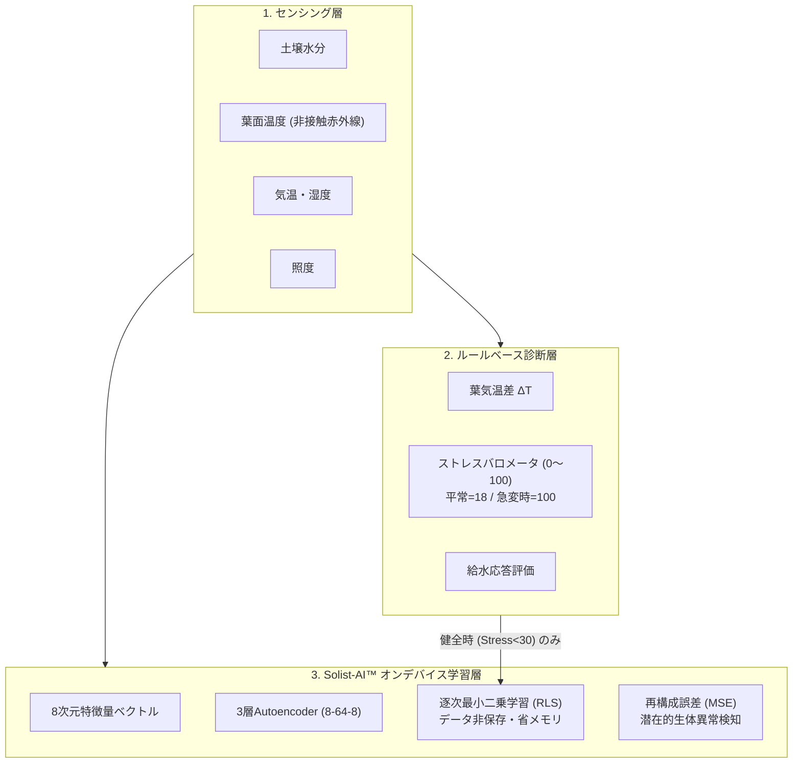

# Plant Doctor 生体AI・オンデバイス学習 教科書 (Textbook)

ようこそ！ 本教材は、ROHM 製超低消費電力マイコン **ML63Q2557** と **Solist-AI™（オンデバイス学習アクセラレータ）** を搭載したスマート植物モニタリングシステム **Plant Doctor** の内部で動作する「AI推論」「オンデバイス逐次学習」「植物生体ストレス診断」の仕組みを、初学者からエンジニアまで深く・直感的に理解できるように構成された公式テキストです。

---

## 📚 カリキュラム構成（全5章）

| 章 | タイトル | 主な学習テーマと疑問の解消 |
|---|---|---|
| **[第1章](01_edge_ai_and_sensing.md)** | **エッジAIと植物生体センシング入門** | ・なぜクラウドではなくマイコン（エッジ）でAIを動かすのか？ ・植物の「声」を捉える葉温・気温差（$\Delta T$）の生理学的背景 ・ML63Q2557 $\to$ ATOMS3 Lite $\to$ plant-medical のシステム連携 |
| **[第2章](02_plant_stress_scoring.md)** | **植物ストレス診断とバロメータ算出ロジック** | ・**【疑問】なぜ平常時のストレス値は「18」なのか？** ・**【疑問】葉温を急変させると「100」になり数秒で「18」に戻る理由は？** ・4大要素（土壌・熱・光・湿度）と支配的要因加算アルゴリズム |
| **[第3章](03_autoencoder_and_anomaly_detection.md)** | **自己符号化器（Autoencoder）と異常検知** | ・自己符号化器（Autoencoder）による「正常データの自己復元」 ・なぜ正常データだけを学習して未知の異常（病気・水切れ予兆）を検知できるのか？ ・8次元生体特徴空間の物理的意味と再構成誤差（MSE） |
| **[第4章](04_on_device_learning_mechanism.md)** | **オンデバイス逐次学習（ODL）の全貌** | ・**【疑問】45,781回学習済みで、1秒ごとに増えるが、過去データを保存しているのか？** ・メモリ32KBで動作する秘密：逐次最小二乗法（RLS）による「データ不保持」学習 ・忘却係数（$\lambda = 0.95$）の物理的意味と学習ゲート（Stress < 30） |
| **[第5章](05_troubleshooting_mse_fixed.md)** | **実機トラブルシューティングと考察** | ・**【疑問】なぜ再構成損失（MSE）が常に「1」で Anomaly Alert が出たのか？** ・固定小数点 $Q8$ と Sigmoid 関数の値域ミスマッチの完全解剖 ・特徴量正規化（Feature Normalization）による解決と正しい収束挙動 |

---

## 🎯 本書で学べるキーコンセプト

1. **エッジでの閉じた自律性 (Edge Autonomy)**:
   ネットワークが切れても、植物のそばにあるマイコン自身が考え、判断し、水をあげ、自己学習を続けます。
2. **生体信号の相関性 (Multivariate Correlation)**:
   単一センサーのしきい値判定だけでは見落とす「蒸散機能の低下」「土壌と葉温の不整合」を、多変量AIが捉えます。
3. **データ不保持・逐次更新 (Online Sequential Learning)**:
   ビッグデータをFlashメモリやSDカードにため込むことなく、数学的な更新アルゴリズム（RLS）で超軽量マイコン上で学習を実行します。

各章を順にお読みいただくことで、組み込みAI（TinyML）と植物生理学が融合した最新のエッジIoT技術を網羅的に理解できます。
まずは **[第1章 エッジAIと植物生体センシング入門](01_edge_ai_and_sensing.md)** からスタートしてください！
