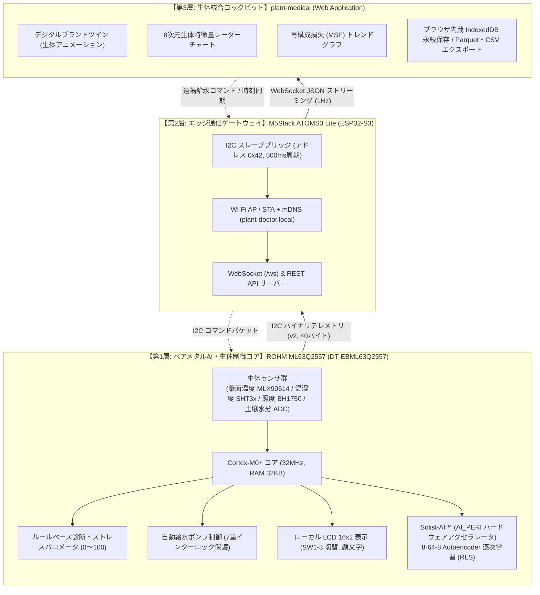

# Plant Doctor 生体AI・オンデバイス学習 教科書 (Textbook)

本書は、ROHM 製超低消費電力マイコン **ML63Q2557** とオンデバイス学習アクセラレータ **Solist-AI™** を中核とするスマート植物生体モニタリングシステム「**Plant Doctor**」の技術教科書です。

組み込みエッジマイコンにおけるリアルタイム推論、データ不保持型逐次学習（Online Sequential Learning）、植物生理学に基づく多変量ストレス診断アルゴリズム、そしてゲートウェイ連携やWebダッシュボード統合に至るまで、最新のソフトウェア実装を標準仕様として体系的かつ詳細に解説します。

---

## 📚 カリキュラム構成（全5章）

| 章 | タイトル | 概要と主な学習項目 |
|---|---|---|
| **[第1章](01_edge_ai_and_sensing.md)** | **エッジAIと植物生体センシング技術** | ・気孔開閉と蒸散気化熱が生み出す葉気温差（$\Delta T$）の生理学的背景 ・非接触赤外線温度、環境温湿度、照度、土壌水分の物理計測仕様 ・電池駆動マイコンが現場で思考するエッジAI（TinyML）の必然性 ・3層ハイブリッド構造（ML63Q2557 / ATOMS3 Lite / plant-medical） |
| **[第2章](02_plant_stress_scoring.md)** | **多変量植物ストレス評価と自律診断アルゴリズム** | ・0〜100フルレンジを活用する生体ストレスバロメータの設計思想 ・4大生体負荷（土壌・熱・光・湿度）の算出数式モデル ・危機を見落とさない「最大値支配（Max Dominance）」合成ロジック ・7段階の優先度付き状態診断と、安全を守る7重の給水インターロック |
| **[第3章](03_autoencoder_and_anomaly_detection.md)** | **自己符号化器（Autoencoder）と多次元生体異常検知** | ・ルールベースでは捉えきれない微小な多変量相関破綻の検知原理 ・正常状態のみを学習する「教師なし異常検知」の数学的アプローチ ・8次元生体特徴ベクトルの正規化（`NormalizeToQ8`）と Sigmoid 出力域整合 ・再構成誤差（MSE）の物理的解釈と異常スコア化 |
| **[第4章](04_on_device_learning_mechanism.md)** | **オンデバイス逐次学習（ODL）の数学と実装** | ・RAM 32KBで何万回も学習を継続できる「データ非保持型（RLS）」の数学構造 ・シャーマン・モリソンの公式による逆行列計算の回避と $O(N^2)$ 計算量 ・学習の進行度を司る3段階フェーズ（Profiling / Stabilizing / Monitoring） ・汚染データを学習させない安全インターロックと数値発散自己修復機構 |
| **[第5章](05_system_integration_and_telemetry.md)** | **システム統合・通信テレメトリと生体コックピット** | ・ML63Q2557 と ATOMS3 Lite を結ぶ I2C バイナリテレメトリ（v2, 0x42） ・ESP32-S3 による WebSocket 配信と mDNS ゼロコンフィグ接続 ・ローカル LCD 16x2 の3画面構成と感情表現顔文字 UI ・ブラウザ完結型 Biological Cockpit、履歴永続化と Parquet/CSV 分析 |

---

## 🎯 システムアーキテクチャ概要

Plant Doctor は、極小電力で生体をミリ秒単位で保護する「マイコン層」、ネットワークとプロトコルを中継する「ゲートウェイ層」、そして人間が植物の生命活動を直感的に把握できる「診察室層」の3層が協調して動作します。

---

## 💡 主要技術諸元

| 項目 | 仕様 |
|---|---|
| **メインMCU** | ROHM (LAPIS Technology) ML63Q2557 (ARM Cortex-M0+, 最大32MHz) |
| **メモリ** | ROM 256KB, RAM 32KB（ベアメタルC言語実装、RTOSなし） |
| **AIアクセラレータ** | 専用ハードウェア回路 `AI_PERI`（Solist-AI™ ライブラリ統合） |
| **ニューラルネット** | 3層自己符号化器（入力8ノード、隠れ層64ノード、出力8ノード） |
| **活性化・損失関数** | Hard Sigmoid 活性化関数、二乗平均誤差（MSE）損失関数 |
| **学習アルゴリズム** | オンデバイス逐次最小二乗法（Recursive Least Squares: RLS） |
| **センシング周期** | 1.0秒（100 ticks @ 10ms システムTick） |
| **ストレス評価** | 0〜100（最大値支配型多変量合成アルゴリズム） |
| **通信インターフェース** | I2C スレーブ（アドレス: `0x42`、ボーレート: 100kHz / 400kHz） |
| **ゲートウェイ** | M5Stack ATOMS3 Lite（ESP32-S3FN8, Wi-Fi 802.11 b/g/n, BLE 5.0） |
| **Webフロントエンド** | React 18 + Vite + TypeScript + Tailwind CSS + Lucide Icons |

本書を読み進めることで、現代の組込みソフトウェア、機械学習理論、植物生理学、そしてIoTネットワークがどのように融合し、自律的な生命維持システムを構成しているのかを深く学べます。

まずは **[第1章 エッジAIと植物生体センシング技術](01_edge_ai_and_sensing.md)** から学習を始めてください。

